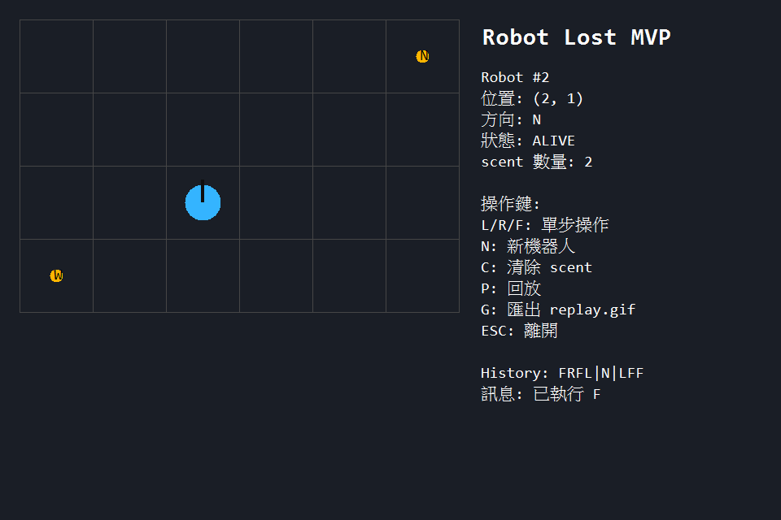

# Week 03 作業總結：Robot Lost（pygame）

## 基本資訊

- **學號**：1111405040
- **週次**：Week 03
- **作業主題**：Robot Lost 規則模擬與互動視覺化
- **提交日期**：2026-03-12

---

## 1. 功能清單

本次實作包含以下功能：

1. 顯示 2D 格子地圖（座標範圍 `(0,0)` 到 `(W,H)`）。
2. 顯示機器人位置與方向。
3. 顯示 scent 記錄點（包含方向）。
4. 鍵盤單步操作 `L` / `R` / `F`。
5. `N` 建立新機器人（保留 scent）。
6. `C` 清除 scent。
7. `P` 回放操作歷程（等效重播機制）。
8. `G` 嘗試輸出 `assets/replay.gif`（若環境具備 imageio / numpy）。
9. 核心邏輯與 pygame 畫面分離（`robot_core.py` / `robot_game.py`）。

---

## 2. 執行方式

### 環境需求

- Python 3.10+（本次使用 Python 3.10）
- pygame

### 安裝指令

```bash
pip install pygame
```

### 啟動遊戲

```bash
cd weeks/week-03/solutions/1111405040
python robot_game.py
```

若系統 `python` 別名不可用，可使用完整路徑：

```bash
C:\Users\a4528\AppData\Local\Programs\Python\Python310\python.exe robot_game.py
```

---

## 3. 測試方式

### 執行全部測試

```bash
cd weeks/week-03/solutions/1111405040
C:\Users\a4528\AppData\Local\Programs\Python\Python310\python.exe -m unittest discover -s tests -p "test_*.py" -v
```

### 測試結果摘要

- 測試檔：2 份（`test_robot_core.py`, `test_robot_scent.py`）
- 測試函式：12 個
- 結果：12/12 通過

---

## 4. 資料結構選擇理由

### (1) `RobotState` 使用 `@dataclass`

- 將 `(x, y, direction, lost)` 集中為單一狀態物件。
- 減少函式傳參長度，讓測試與畫面層共用一致狀態。

### (2) `scent` 使用 `set[tuple[int, int, str]]`

- 直接對應規格「位置 + 方向」判斷。
- `set` 查詢平均 O(1)，適合每次 `F` 都要快速檢查。

### (3) 方向與位移使用字典對照

- `LEFT_TURN` / `RIGHT_TURN`：旋轉規則清楚。
- `MOVE_STEP`：方向到位移量的映射固定且可讀。

### (4) 回放使用 `Snapshot` 清單

- 每一步記錄狀態與 scent。
- 不需重算，即可直接按時間序列重播。

---

## 5. 一個 bug 與修正方式

### 問題

在 scent 測試中，第二台機器人執行 `FRF` 時，原本測試預期「不會 LOST」，但實際會 LOST。

### 原因

- 第一個 `F` 因 scent 被忽略，位置仍在 `(5,3)`、方向 `N`。
- `R` 後方向變成 `E`。
- 最後一個 `F` 往東越界，依規則應 LOST。

### 修正

將測試改為 `FR`，驗證「忽略危險 `F` 後仍可繼續執行下一步指令」這個核心行為。

---

## 6. 遊玩截圖



---

## 7. 重播方式說明

### 互動回放（等效重播）

1. 進入遊戲後執行多次 `L/R/F`。
2. 按 `P` 開始回放。
3. 再按一次 `P` 可停止回放。

### 匯出 GIF（選配）

- 按 `G` 會嘗試輸出 `assets/replay.gif`。
- 若環境缺少 `imageio` 或 `numpy`，畫面會提示無法輸出。
- 本提交已附上 `assets/replay.gif` 作為回放檔。

---

## 檔案結構

```text
weeks/week-03/solutions/1111405040/
├── robot_game.py
├── robot_core.py
├── assets/
│   ├── gameplay.png
│   └── replay.gif
├── tests/
│   ├── test_robot_core.py
│   └── test_robot_scent.py
├── TEST_CASES.md
├── TEST_LOG.md
├── AI_USAGE.md
└── README.md
```
