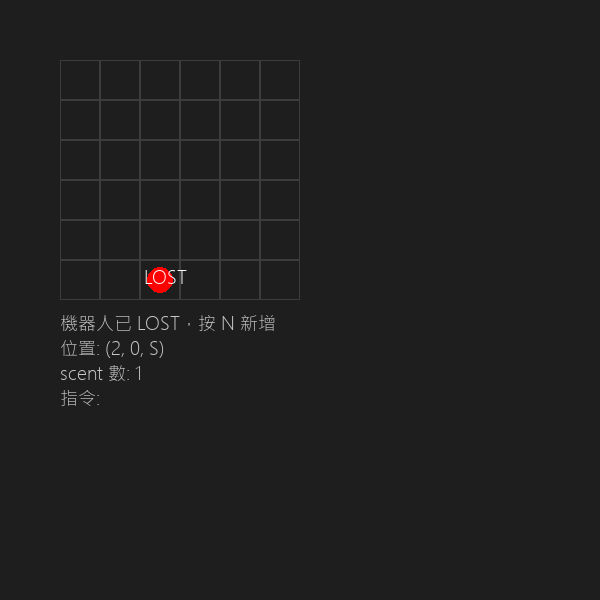

# Robot Lost

## 功能清單

- 6x6 格子地圖顯示
- 鍵盤 L/R/F 控制機器人轉彎前進
- LOST 狀態標示（紅圈 + 文字）
- scent 標記（紅點）與 scent 保護機制
- N 新增機器人（保留 scent）
- C 清除 scent
- G 匯出 replay.gif
- ESC 離開

## 執行方式

```
pip install pygame
python robot_game.py
```

## 測試方式

```
python -m unittest discover -s tests -p "test_*.py" -v
```

27 tests 全部 PASS。

## 資料結構選擇理由

1. **scent 用 `set[tuple[int, int, str]]`**：O(1) 查詢，自動去重
2. **Robot 與 RobotWorld 分離**：核心邏輯不綁 pygame，容易測試
3. **DIR_ORDER 用 list + mod 旋轉**：`(idx ± 1) % 4` 簡潔不易錯

## Bug 與修正

`test_same_pos_different_dir_not_protected` 起點設 (0,5,E)，往 E 走 (1,5) 不會越界。修正為 (5,5,E)。

## 遊玩截圖



## 重播方式

按 G 鍵會自動匯出 `assets/replay.gif`，可用瀏覽器或圖片檢視器播放。
