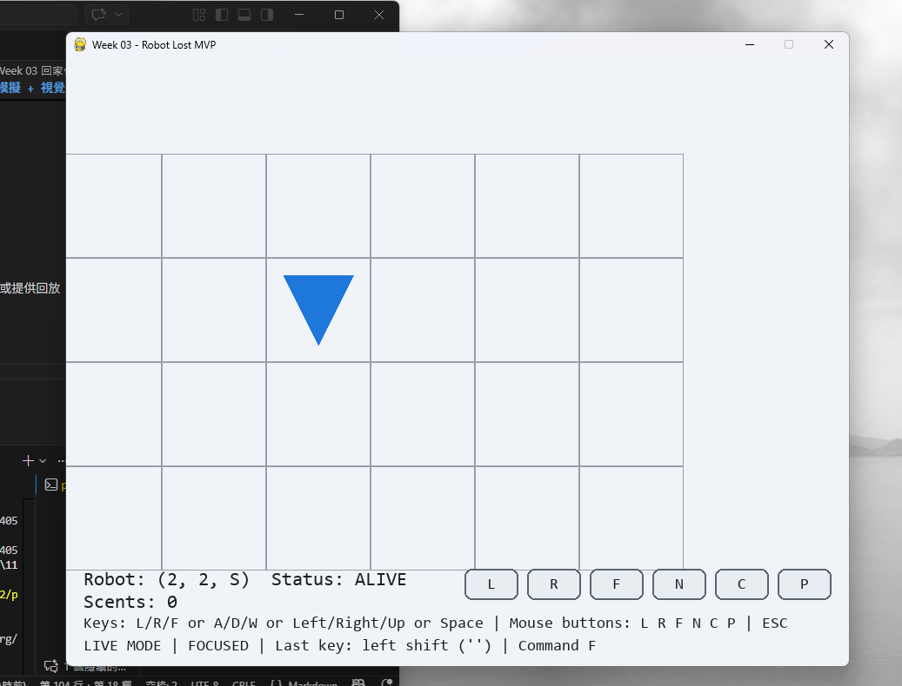

# Week 03 作業：Robot Lost（pygame MVP）

本專案將 UVA 118 的規則（L/R/F、LOST、scent）做成可互動的 pygame 小遊戲，並將核心規則與畫面邏輯分離，方便測試與維護。

## 1. 功能清單（互動功能）
- 顯示地圖格子：座標範圍為 `(0,0)` 到 `(W,H)`。
- 顯示機器人位置與朝向：使用三角形表示 N/E/S/W。
- 顯示 `scent`：在危險位置畫出標記。
- 支援鍵盤操作：`L/R/F`、`N`、`C`、`P`、`ESC`。
- 支援擴充鍵盤操作：`A/D/W`、方向鍵、空白鍵。
- 支援滑鼠按鈕操作：可直接點畫面按鈕 `L` `R` `F` `N` `C` `P`。
- 新機器人重置：按 `N` 後回到 `(0,0,N)`，且保留既有 `scent`。
- 清除 `scent`：按 `C` 清空危險紀錄。
- 回放機制：按 `P` 逐幀回播歷史狀態。

## 2. 執行方式（Python 版本、安裝 pygame、啟動遊戲）
- Python 版本：`3.10+`（本環境實測 `3.12.10`）。
- 安裝 pygame：

```bash
python -m pip install pygame
```

- 啟動遊戲：

```bash
python robot_game.py
```

## 3. 測試方式（測試指令與結果摘要）
- 執行指令：

```bash
python -m unittest discover -s tests -p "test_*.py" -v
```

- 測試摘要：
- 總數：12
- 通過：12
- 失敗：0

## 4. 資料結構選擇理由（至少 3 點）
1. `set[tuple[int, int, str]]` 儲存 `scent`：可用 O(1) 查詢，且完整對應題目「位置 + 方向」規則。
2. `Robot` 使用 `dataclass`：把 `x/y/direction/lost` 集中管理，狀態欄位清楚可讀。
3. `RobotWorld` 封裝規則：把旋轉、前進、越界、LOST、scent 判斷統一放在核心模組，便於測試。
4. `Snapshot` 保存回放狀態：每一幀保存機器人狀態與 scent 複本，避免歷史資料被後續操作污染。

## 5. 我踩到的一個 bug 與修正方式
- 問題：機器人一旦 `LOST`，後續指令仍然被執行，造成狀態不正確。
- 修正：在 `execute()` 每步執行後檢查 `robot.lost`，若為 `True` 立即 `break`，停止後續指令。

## 6. 內嵌遊玩截圖（`assets/gameplay.png`）
- 截圖請放在：`assets/gameplay.png`。
- README 內嵌如下：



## 7. 重播方式說明（`assets/replay.gif` 或等效回放）
- 本專案提供「等效回放」：按 `P` 進入回放模式，逐幀重播操作歷史。
- 若要交 `assets/replay.gif`：
1. 啟動遊戲並完成一段操作。
2. 進入回放模式（按 `P`）。
3. 使用螢幕錄製工具錄下回放畫面並匯出為 GIF。
4. 存成 `assets/replay.gif`，可在 README 補上：``。

## 專案結構
```text
.
├── robot_game.py
├── robot_core.py
├── assets/
│   ├── gameplay.png
│   └── replay.gif (optional)
├── tests/
│   ├── test_robot_core.py
│   └── test_robot_scent.py
├── TEST_CASES.md
├── TEST_LOG.md
├── AI_USAGE.md
└── README.md
```
