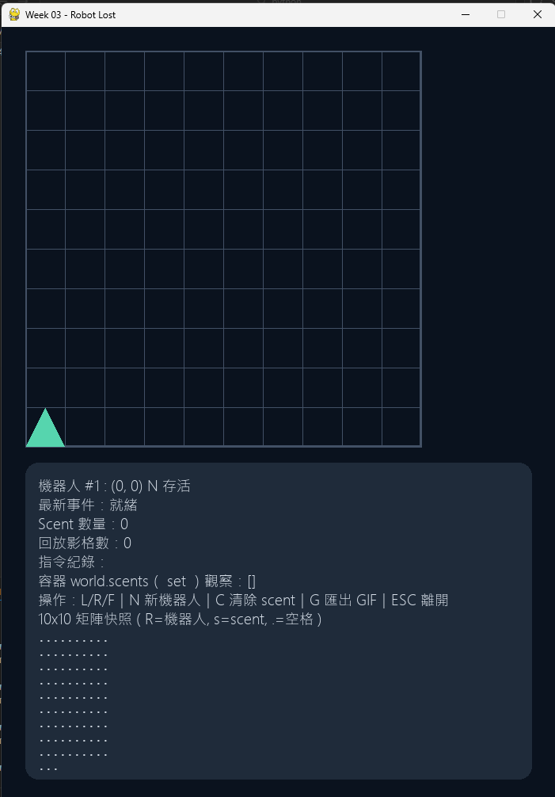

# Week 03 - Robot Lost

## 功能清單
- 格子地圖顯示
- 中文化機器人位置與狀態顯示（ALIVE/LOST、操作提示）
- scent 可視化
- 鍵盤操作 `L/R/F`
- `N` 新機器人（保留 scent）
- `C` 清除 scent
- 顯示 10x10 字串矩陣快照（面板內）
- 顯示 `scent` 容器內容（資訊面板）
- `M` 可將矩陣快照與 `scent` 狀態輸出到終端機
- `G` 提供 GIF 匯出事件入口（目前為提示訊息）

## 執行方式
1. 建議使用 Python 3.11 或 3.12
2. 切到本作業資料夾：
   - `cd weeks/week-03/solutions/1114405010`
3. 安裝 pygame：
   - `pip install pygame`
4. 啟動遊戲：
   - `python robot_game.py`

若你的預設 Python 是 3.14，請改用 Python 3.12 虛擬環境：
- `py -V:Astral/CPython3.12.13 -m venv .venv312`
- `.\.venv312\Scripts\python.exe -m pip install -U pip setuptools wheel`
- `.\.venv312\Scripts\python.exe -m pip install pygame`
- `.\.venv312\Scripts\python.exe robot_game.py`

## 測試方式
- 先切到本作業資料夾：`cd weeks/week-03/solutions/1114405010`
- 執行：`python -m unittest discover -s tests -p "test_*.py" -v`
- 結果摘要：請見 `TEST_LOG.md`

## 資料結構選擇理由
1. `RobotState` 使用 dataclass，狀態清楚、好維護。
2. `set[(x, y, dir)]` 查詢 scent 為 O(1)，符合規則需求。
3. 方向與位移分離（DIRECTIONS/MOVE），便於測試與擴充。

## 一個 bug 與修正
- 問題：第二台機器人在危險邊界仍被判定 LOST。
- 修正：先檢查 scent 是否存在，再決定是否標記 LOST。

## 遊玩截圖
請將你的實際遊玩畫面放在 `assets/gameplay.png`。

## 重播方式
- 建議輸出檔案：`assets/replay.gif`
- 目前按 `G` 會觸發匯出入口提示（尚未實作實際寫檔流程）。

