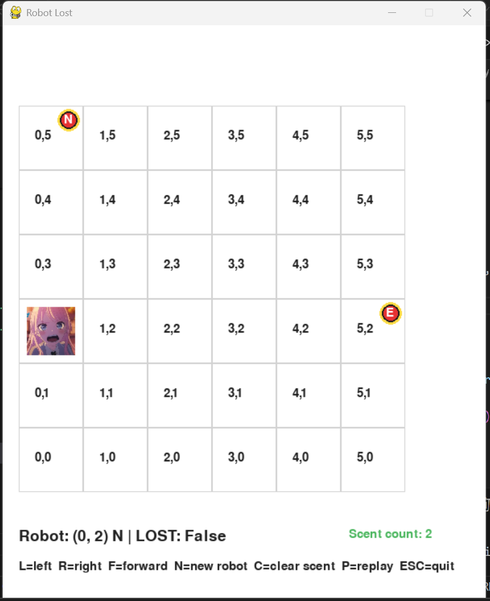

# Robot Lost - Week 03 Homework

Student ID: 1114405029

This project implements the Robot Lost simulation (inspired by UVA 118) using Python and pygame.  
The program visualizes robots moving on a grid and demonstrates the scent rule when robots fall off the map.

---

# 1. 功能清單 (Implemented Features)

The following interactive features are implemented:

- Grid world visualization using pygame
- Robot movement with keyboard controls
- Robot orientation (N / E / S / W)
- Robot LOST detection when leaving the grid
- Scent system to prevent repeated robot loss
- Multiple robot spawning
- Replay system to review robot actions
- HUD status display including:
  - Robot position
  - Robot direction
  - LOST status
  - Scent count

Keyboard controls:

L = turn left  
R = turn right  
F = move forward  
N = spawn new robot  
C = clear scent markers  
P = replay previous actions  
ESC = quit program

---

# 2. 執行方式 (How to Run)

Python version:

Python 3.11+

Install dependency:

pip install pygame

Run the program:

python robot_game.py

A pygame window will open showing the robot grid simulation.

---

# 3. 測試方式 (Testing Method)

Unit tests are implemented for the core robot logic.

Test files:

tests/test_robot_core.py  
tests/test_robot_scent.py

Example test cases include:

- Robot turning left/right
- Robot moving forward
- Robot falling off the grid
- Scent behavior preventing repeated loss

Run tests with:

python -m unittest discover -s tests -p "test_*.py" -v

---

# 4. 資料結構選擇理由 (Data Structure Design)

1. Using a set to store scent positions

scents = set()

Reason:
- Fast lookup of scent positions
- Prevent duplicate scent entries
- Efficient O(1) membership checking

Each scent stores:

(x, y, direction)

---

2. Using a list for replay frames

replay_frames = []

Reason:
- Stores historical robot states
- Allows sequential playback
- Maintains chronological order

---

3. Robot class

class Robot

Reason:
- Encapsulates robot state (x, y, direction, lost)
- Improves readability
- Makes movement logic modular

---

# 5. 遇到的 Bug 與修正 (Bug and Fix)

Bug:

ModuleNotFoundError: No module named 'pygame'

Cause:

The pygame library was not installed.

Solution:

pip install pygame

After installing pygame the program ran correctly.

---

# 6. 遊玩截圖 (Gameplay Screenshot)

The screenshot shows the grid world, robot position, scent markers and status HUD.

---

# 7. Replay 功能說明 (Replay System)

The program includes an interactive replay system.

Robot states are stored in:

replay_frames

Press:

P

to start replay mode.

During replay the program sequentially loads stored states and reconstructs the robot movements and scent events.

This replay system acts as an equivalent alternative to generating a replay.gif.

---

# Project Structure

1114405029/

robot_core.py  
robot_game.py  

assets/  
robot.png  
gameplay.png  

tests/  
test_robot_core.py  
test_robot_scent.py  

TEST_CASES.md  
TEST_LOG.md  
AI_USAGE.md  
README.md

---

# Summary

This project demonstrates:

- grid simulation
- robot state management
- scent rule implementation
- pygame visualization
- replay functionality
- test-driven robot logic

The system recreates the Robot Lost problem with interactive visualization.