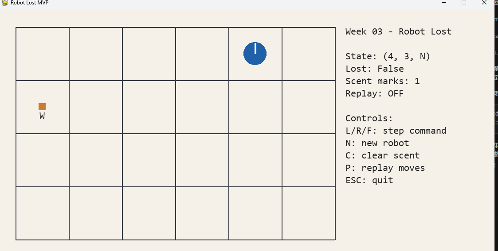

# Week 03 - Robot Lost



## 1. 功能清單

- 顯示 `(0, 0)` 到 `(W, H)` 的格子地圖
- 顯示機器人位置與朝向（`N/E/S/W`）
- 顯示 `scent` 危險標記（含方向）
- 以鍵盤 `L/R/F` 逐步執行指令
- `N` 建立新機器人（保留現有 `scent`）
- `C` 清除所有 `scent`
- `P` 回放目前機器人的操作歷程（等效 replay）

## 2. 執行方式

- Python 版本：`3.9.6`
- 安裝套件：

```bash
py -m pip install pygame
```

- 啟動遊戲（在本資料夾下）：

```bash
py robot_game.py
```

## 3. 測試方式

在 `weeks/week-03/solutions/1114405056/` 目錄下執行：

```bash
py -m unittest discover -s tests -p "test_*.py" -v
```

測試結果摘要：共 11 個測試，全部通過（`OK`）。

## 4. 資料結構選擇理由

- `set[tuple[int, int, str]]` 儲存 `scent`
  - 可用 O(1) 平均時間快速判斷危險前進是否需要忽略。
  - 以 `(x, y, direction)` 完整對應題目規則，避免方向混淆。
  - `set` 天然去重，不會重複記錄同一個危險標記。
- `RobotState`（dataclass）儲存機器人狀態
  - 欄位清楚，便於測試與除錯。
  - 每一步都能保留狀態快照，方便回放。
- 方向表與位移表（`DIRECTIONS`、`MOVE_VECTOR`）
  - 讓轉向與移動邏輯一致、可預測。
  - 降低大量 `if/elif` 分支，提升可讀性。

## 5. 一個 bug 與修正方式

- 問題：一開始把 world 座標的 `y+1` 當成畫面往下，導致地圖上下顛倒。
- 修正：將演算法座標與繪圖座標分離，透過 `world_to_screen()` 做 `y` 軸反轉轉換。

## 6. 內嵌遊玩截圖

- 已於文件最上方內嵌：``
- 截圖檔案位置：`assets/gameplay.png`

## 7. 重播方式說明

- 本作業使用「程式內建回放」作為 `replay.gif` 的等效方案。
- 操作方式：在遊戲視窗按 `P`，會依序播放歷史狀態。
- 檢視方式：直接在遊戲畫面觀察回放過程與 HUD 狀態。
