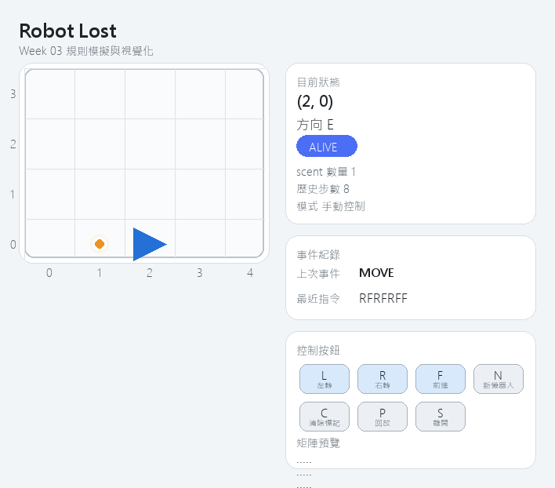

# Week 03 Robot Lost

## 功能清單
- 規則核心獨立在 robot_core.py，與畫面解耦，便於測試。
- pygame 2D 格子地圖顯示（座標 0,0 到 W,H）。
- 預設地圖為 5x4（x: 0~4，y: 0~3）。
- 機器人朝向顯示（N/E/S/W 三角箭頭）。
- scent 顯示（橘色點）。
- 鍵盤逐步執行 L、R、F。
- N 建立新機器人（保留 scent）。
- C 清除 scent。
- P 啟動回放模式，逐幀重播操作歷程。
- S 離開遊戲。
- 額外提供 10x10 字串矩陣快照函式 grid_snapshot，可觀察容器狀態。

## 執行方式
- Python 版本：3.14.3
- 安裝相依套件：

```bash
python -m pip install pygame-ce
```

- 啟動遊戲：

```bash
python robot_game.py
```

- 自動產生示範截圖：

```bash
python robot_game.py --capture --capture-path assets/gameplay.png
```

## 操作按鍵
- L / R / F：執行一步
- N：新機器人
- C：清除 scent
- P：回放操作歷程
- S / ESC：離開

## 測試方式
執行指令：

```bash
python -m unittest discover -s tests -p "test_*.py" -v
```

結果摘要：12 個測試全通過，覆蓋方向旋轉、越界判定、scent 規則、LOST 停止執行與非法指令處理。

## 資料結構選擇理由
1. 使用 set[(x, y, dir)] 存 scent，可在 O(1) 平均時間判斷危險越界是否應忽略。
2. 使用 dataclass RobotState 與 World，讓狀態欄位清楚且便於序列化到回放快照。
3. 將 StepResult.status 字串化，讓測試可直接驗證狀態轉移（MOVE、LOST、SCENT_BLOCKED）。

## 一個實際 bug 與修正
- 問題：一開始測試中 N + L 期望值誤寫成 E，導致 Red 階段失敗。
- 修正：改回正確規則 N + L = W，重新執行後全部測試轉為 Green。

## 遊玩截圖


## 回放方式
- 進入遊戲後按 P 即可重播歷史操作。
- 回放中若再次輸入 L、R、F、N、C，會立即回到手動操作模式。
- 本作業採用內建逐幀回放機制，不強制輸出 GIF。
