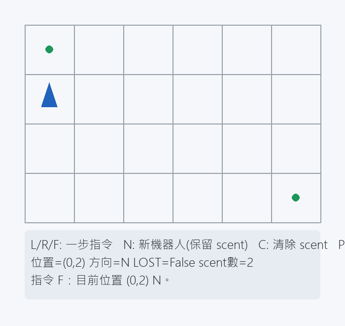
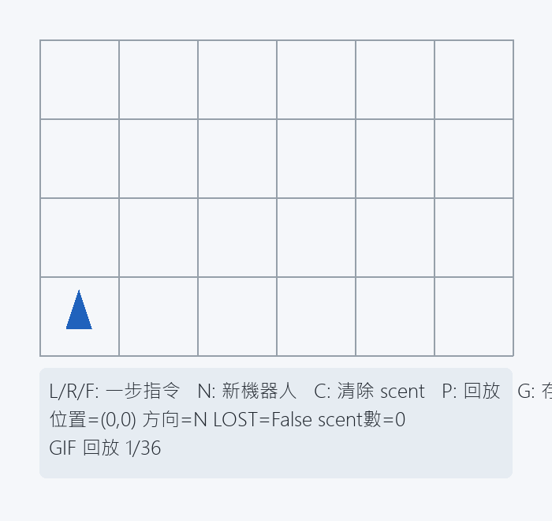

# Week 03 回家作業：Robot Lost（pygame）

本作業將 UVA 118 的核心規則（L/R/F、LOST、scent）做成可互動遊戲，並把規則引擎拆分到 `robot_core.py` 以便測試。

## 1. 功能清單

- 顯示格子地圖與座標對應
- 顯示機器人位置與朝向（箭頭三角形）
- 顯示 scent（綠色點）
- 鍵盤一步操作：`L` / `R` / `F`
- 新機器人（保留 scent）：`N`
- 清除 scent：`C`
- 回放歷史步驟：`P`
- 匯出回放 GIF：`G`（輸出 `assets/replay.gif`）
- 儲存遊玩截圖：`S`（輸出 `assets/gameplay.png`）

## 2. 執行方式

### 環境需求

- Python 3.13+
- 套件：`pygame`、`pillow`

### 安裝與啟動

```bash
pip install pygame pillow
python robot_game.py
```

## 3. 測試方式與結果摘要

在 `weeks/week-03/solutions/week03_1114405018/` 執行：

```bash
python -m unittest discover -s tests -p "test_*.py" -v
```

最新結果摘要：

- 測試總數：15
- 通過：15
- 失敗：0
- 結論：`OK`

## 4. 資料結構設計理由

- 使用 `RobotState(x, y, direction, lost)`：將機器人狀態集中，利於測試與畫面同步。
- 使用 `set[tuple[int, int, str]]` 儲存 scent：查詢是否為危險點為 O(1)，且方向被納入鍵值可避免誤判。
- 使用 `history: list[RobotState]`：可支援回放與 GIF 匯出，不影響核心規則計算。

## 5. 遇到的 Bug 與修正

Bug：單次按鍵在部分輸入法下可能同時觸發 `KEYDOWN` 與 `TEXTINPUT`，導致前進超過一格。

修正：

- 非文字按鍵（方向鍵）放在 `KEYDOWN`。
- 文字指令（L/R/F/N/C/P/G/S）統一在 `TEXTINPUT`。
- 讓一次按鍵只執行一次邏輯。

## 6. 遊玩證明截圖（必交）



## 7. 重播方式（GIF）

操作步驟：

1. 先在遊戲中操作幾步（建立歷史）。
2. 按 `G` 匯出回放。
3. 產生檔案：`assets/replay.gif`。

預覽：


