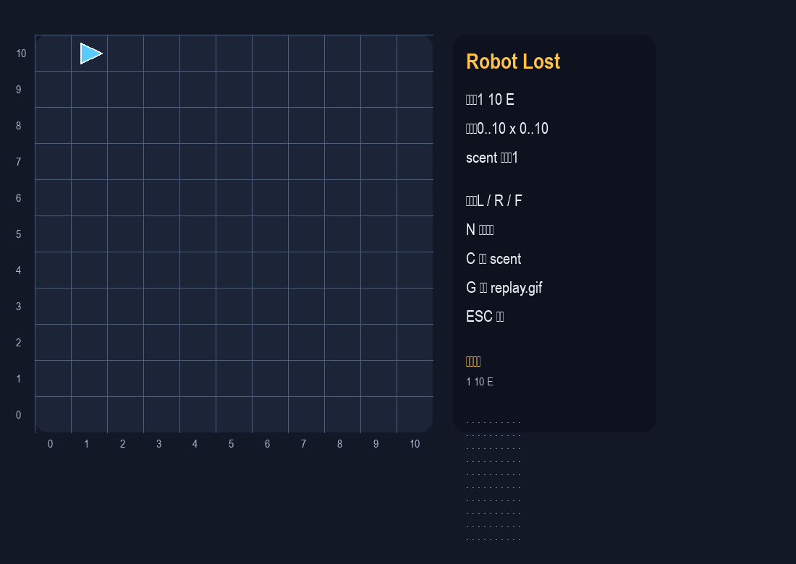

# Week 03 - Robot Lost

這份作業以 UVA 118 的規則模擬為核心，做成可互動的 pygame MVP，並把核心邏輯拆開供單元測試使用。

## 功能清單

- 顯示 10x10 格子地圖。
- 顯示機器人目前位置與朝向。
- 顯示 `scent` 標記。
- 可用鍵盤 `L / R / F` 一步一步執行。
- 可用 `N` 重置新機器人，保留 `scent`。
- 可用 `C` 清除 `scent`。
- 可用 `G` 匯出 `assets/replay.gif`。
- 左側 HUD 顯示目前狀態、地圖範圍與操作說明。

## 執行方式

環境：Python 3.10 以上。

安裝：

```bash
python -m pip install pygame Pillow
```

啟動遊戲：

```bash
python robot_game.py
```

## 測試方式

```bash
python -m unittest discover -s tests -p "test_*.py" -v
```

目前測試涵蓋旋轉、邊界、LOST、scent 與非法指令。

## 資料結構選擇理由

- `RobotState` 用 dataclass，方便直接讀寫與比對。
- `scent` 用 `set[tuple[int, int, str]]`，查找成本低，也能明確區分方向。
- `snapshot_history` 保留每一步狀態，方便重播與匯出 GIF。

## 遇到的 bug 與修正

一開始我把 LOST 後的指令處理寫成只標記狀態，但沒有立即停止後續指令，導致同一台機器人還會繼續執行 L/R/F。後來改成只要 `state.lost` 為真就直接中止 `execute_commands()`，問題就消失了。

## 遊玩截圖



## Replay 說明

按 `G` 會嘗試把目前的狀態歷程匯出成 `assets/replay.gif`。若環境沒有安裝 Pillow，程式會顯示無法輸出 GIF，但核心遊戲仍可正常執行。匯出的 GIF 可以直接用瀏覽器、圖片檢視器或 VS Code 預覽開啟。

## 補充

- 非法指令策略：核心層對 `X` 這類字元會直接拋出 `ValueError`。
- 介面文字使用中文，方便在課堂或口頭說明時操作。