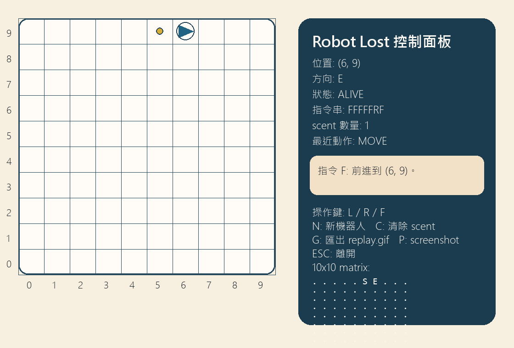

# Week 03 Homework - Robot Lost

這份作業實作了 Robot Lost 的核心規則模擬與 pygame 視覺化版本，放在 `weeks/week-03/week3-HW-1114405040/`。

## 功能清單

- 顯示 10x10 格子地圖與座標軸
- 顯示機器人位置、朝向與 LOST 狀態
- 顯示 scent 標記
- 以鍵盤 `L / R / F` 逐步控制機器人
- 使用 `N` 建立新機器人並保留 scent
- 使用 `C` 清除 scent
- 使用 `G` 匯出 `assets/replay.gif`
- 使用 `P` 匯出 `assets/gameplay.png`
- 右側 HUD 顯示命令歷史、最近動作、狀態訊息與 10x10 matrix

## 執行方式

### Python 版本

- Python 3.14

### 安裝套件

由於 Python 3.14 對傳統 `pygame` wheel 支援較不穩定，這份作業使用相容的 `pygame-ce` 套件，匯入方式仍是 `import pygame`。

```powershell
cd weeks/week-03/week3-HW-1114405040
..\..\..\.venv\Scripts\python.exe -m pip install pygame-ce pillow
```

### 啟動遊戲

```powershell
cd weeks/week-03/week3-HW-1114405040
..\..\..\.venv\Scripts\python.exe robot_game.py
```

### 操作方式

- `L`: 左轉
- `R`: 右轉
- `F`: 前進
- `N`: 建立新機器人
- `C`: 清除 scent
- `G`: 匯出回放 GIF
- `P`: 匯出遊玩截圖
- `ESC`: 離開遊戲

## 測試方式

```powershell
cd weeks/week-03/week3-HW-1114405040
..\..\..\.venv\Scripts\python.exe -m unittest discover -s tests -p "test_*.py" -v
```

測試摘要：

- 測試檔 2 份
- 測試函式 13 個
- 目前結果：13/13 通過

## 資料結構選擇理由

1. `Robot` 使用 dataclass，讓 `(x, y, direction, lost)` 狀態集中管理，轉向與狀態快照都容易測試。
2. `World.scent_marks` 使用 `set[tuple[int, int, str]]`，可以用 $O(1)$ 查詢危險位置，且能正確區分同座標不同方向。
3. 遊戲重播歷程使用 `FrameState` 清單，讓螢幕渲染、截圖與 GIF 匯出共用同一份狀態來源，避免畫面和邏輯不同步。

## 遇到的 bug 與修正

一開始直接安裝 `pygame` 到 Python 3.14 環境時，因為沒有可用 wheel 而卡在建置流程，導致遊戲無法啟動。後來改成建立本地 `.venv` 並使用 `pygame-ce`，保留 `import pygame` 介面，同時讓 Windows 上可以正常執行與產生素材。

## 遊玩截圖



## 重播方式說明

- 進入遊戲後按 `G`，會把目前歷程輸出成 `assets/replay.gif`
- 這份作業已附上預先匯出的回放檔，可直接開啟 `assets/replay.gif` 檢視

## 檔案說明

- `robot_core.py`: 核心規則與 scent 判定
- `robot_game.py`: pygame 互動介面與素材匯出
- `tests/`: 單元測試
- `TEST_CASES.md`: 自設測資
- `TEST_LOG.md`: Red / Green 紀錄
- `AI_USAGE.md`: AI 使用紀錄