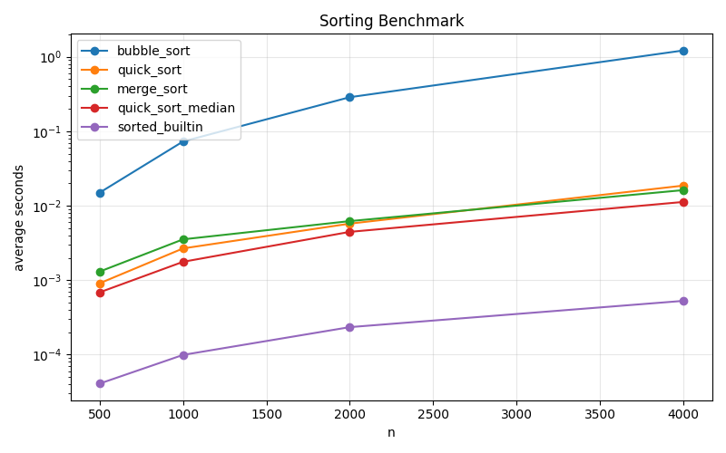

# Week 16 - 1114405041 - 賴俋勳

## 專題摘要

本專題整合 `@timeit`、三種排序、效能基準測試、加速方案與視覺化。
加速策略採用 quick sort 的 median-of-three 以及小區間 insertion sort。

## 方法

- Stage 1：`timing.py` 實作 `timeit`，保留回傳值與 metadata
- Stage 2：`sorts.py` 實作 bubble / quick / merge，且不修改輸入
- Stage 3：`benchmark.py` 納入 `sorted_builtin` baseline 與 `quick_sort_median`
- Stage 4：`plot.py` 將 `results.json` 繪製成 `assets/benchmark.png`

## 圖表

