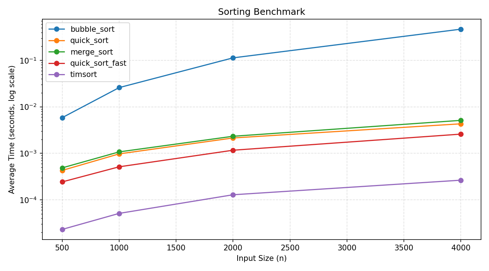

# Week 16 排序效能實驗室 — 1111405038

## 實驗方法

使用自製 `@timeit` 裝飾器（Stage 1）對 bubble sort、quick sort、merge sort 三種排序、一個加速版（quick_sort_fast）以及內建 timsort 進行效能量測。每個 n 以固定 seed=42 產生相同亂數資料，重複 3 次取平均，確保結果可重現。加速版採用 Python 純演算法優化（不使用 Cython）。

---

## Benchmark 數據表

資料量（n）| bubble_sort | quick_sort | merge_sort | quick_sort_fast | timsort
---|---|---|---|---|---
500  | 0.005852 s | 0.000429 s | 0.000487 s | 0.000243 s | 0.0000231 s
1000 | 0.025927 s | 0.000972 s | 0.001073 s | 0.000513 s | 0.0000510 s
2000 | 0.113133 s | 0.002139 s | 0.002327 s | 0.001166 s | 0.000128 s
4000 | 0.468687 s | 0.004313 s | 0.005116 s | 0.002588 s | 0.000264 s

---

## 實驗結果圖表

**圖表解讀：**
timsort（C 實作）最快，在 n=4000 時僅需 0.000264 s，比 bubble_sort 快約 1775 倍。bubble_sort 的折線斜率明顯比其他演算法陡，體現 O(n²) 在大資料時的急速增長，而 quick_sort、merge_sort、quick_sort_fast 的斜率接近，符合 O(n log n) 特性。quick_sort_fast 在 n=4000 比原版 quick_sort 快約 40%（0.00431 s → 0.00259 s），median-of-three + insertion sort 優化在大資料量時效果明顯。

---

## Stage 5 安全自掃報告

| # | OpenSSF 條目 | CWE | 問題描述 | 處理方式 |
|---|-------------|-----|---------|---------|
| 1 | 03 Numbers / 邊界條件 | CWE-20 | `make_data(n)` 允許 `n=0`，產生空清單進 benchmark，量測結果無意義 | 改為 `n <= 0` 時拋出 `ValueError("n must be > 0")` |
| 2 | 03 Numbers / 邊界條件 | CWE-20 | `run_benchmark(sizes=...)` 未驗證 sizes 是否含非正值，`n=0` 會靜默執行 | 增加 `any(n <= 0 for n in sizes)` 檢查，拋出 `ValueError("sizes must be positive")` |
| 3 | 05 Exception Handling | CWE-390 | `load_results()` 直接讓 `json.JSONDecodeError` 傳出，底層訊息不易判讀 | 捕捉後轉拋 `ValueError("invalid json")`，明確訊息方便呼叫端處理 |
| — | 04 Neutralization | CWE-502 | 判定**不適用**：`load_results()` 已使用 `json.load()`，資料來源為自己產生的 benchmark 結果，無反序列化攻擊風險，無需改用其他方案 | — |
| — | 08 Coding Standards | — | 判定**不適用**：`sorts.py` 中的迴圈操作 copy 後的 list，不存在邊迭代邊改的問題；`results.json` 與 PNG 均使用 `with` 開關檔，符合標準 | — |
