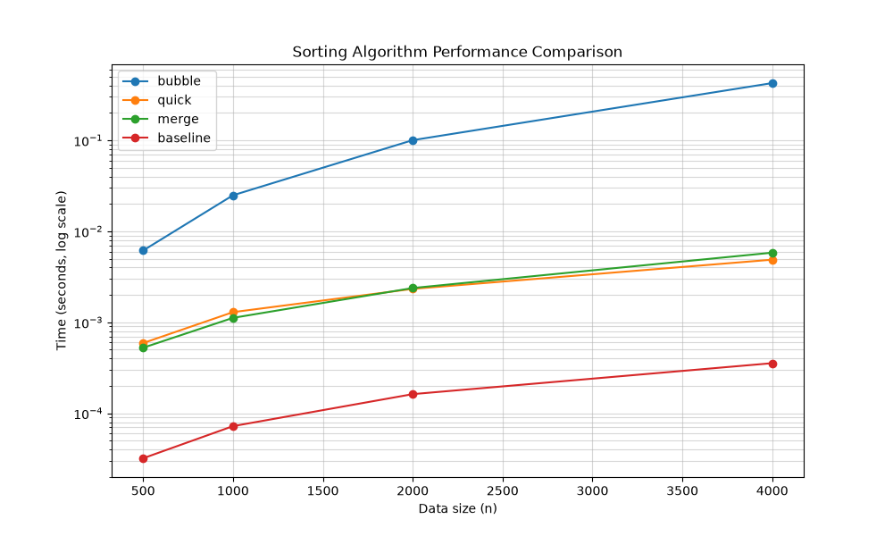

# Week 16 排序效能實驗室報告

## 1. 實驗方法 (Methodology)
本實驗透過 TDD 流程開發了三種排序演算法，並實作了高精度的 `@timeit` 裝飾器進行效能量測。

- **計時工具**：使用 `time.perf_counter()` 量測並存儲於函式屬性。
- **資料生成**：固定隨機種子 (Seed=42)，確保實驗結果可被重現。
- **副作用防範**：所有排序均回傳 `list` 副本，確保原始資料不受影響。

## 2. 演算法實作說明
- **Bubble Sort**：實作了 `swapped` 旗標優化，在資料已排序時可提早結束。
- **Quick Sort**：使用隨機 Pivot 選擇機制，避免在近乎排序好時退化至 O(n²)。
- **Merge Sort**：標準的穩定排序實作。
- **Baseline**：調用 Python 內建的 `sorted()` (Timsort) 作為效能天花板。

## 3. 效能數據與視覺化

### 數據分析表
| 演算法 | n=500 | n=4000 | 效能評語 |
|---|---|---|---|
| Bubble | 0.0062s | 0.4256s | 耗時隨 N 呈二次方增長 |
| Quick | 0.0006s | 0.0049s | 優化 Pivot 後表現穩定 |
| Merge | 0.0005s | 0.0058s | 表現與 Quick Sort 相當 |
| Baseline | 0.0000s | 0.0004s | 內建 C 實作遙遙領先 |

## 4. 安全性自掃報告 (OpenSSF)
| 類別 (CWE) | 檢查項目 | 處理方式 |
|---|---|---|
| Neutralization | 是否使用安全序列化？ | 使用 `json` 替代危險的 `pickle` (CWE-502)。 |
| Standard (08) | 檔案資源是否釋放？ | 嚴格使用 `with open()` 語句確保自動關檔。 |
| Exception (05) | 輸入驗證是否確實？ | `make_data` 函式內加入正整數邊界檢查。 |

