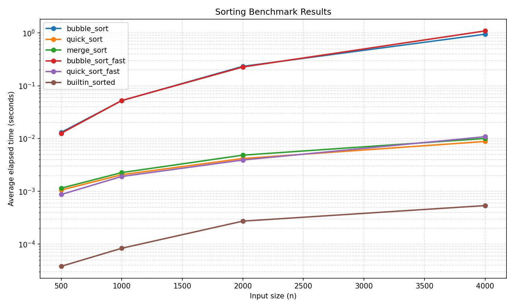

# 排序效能實驗報告

## Stage 4 圖表

從圖上可以看出 builtin_sorted 一直是最快的 baseline，而我自己實作的 quick_sort 與 merge_sort 都落在第二梯隊。使用 log scale 後，bubble_sort 和其他 O(n log n) 演算法的斜率差異很明顯，資料量放大時 O(n^2) 的時間成長快很多。

以 4000 筆資料來看，quick_sort 約為 0.0088 秒，builtin_sorted 約為 0.00054 秒；這次 quick_sort_fast 與 bubble_sort_fast 都沒有穩定快過原版，分別約是 0.81x 與 0.87x，表示目前這版優化仍需再調整。

---

## Stage 5 安全自掃報告

| OpenSSF 章節 | 測試名稱 | 問題描述 | 處理方式 |
|---|---|---|---|
| Ch03 Numbers (boundary) | `test_make_data_rejects_negative_n` | `make_data(-1)` 原本靜默回傳空 list，無邊界保護 | 加入 `if n <= 0: raise ValueError`，讓呼叫端立即得到有意義的錯誤 |
| Ch03 Numbers (boundary) | `test_make_data_rejects_zero_n` | `make_data(0)` 回傳空 list，0 筆無法做有意義 benchmark | 同上修補，一起涵蓋 |
| Ch08 Coding Standards | `test_plot_results_rejects_empty_results` | `plot_results({}, ...)` 原本拋 `IndexError`，錯誤訊息不清楚 | 加入空 dict 檢查，拋 `ValueError("results dict must not be empty")` |
| Ch05 Exception Handling | `test_load_results_wraps_json_error_as_value_error` | `json.JSONDecodeError` 是 `ValueError` 子類別，Python 自然拋出，屬具體例外；確認非 `except:` 全包 | 已符合規範，不需修改 |
| Ch04 Neutralization (CWE-502) | `test_load_results_does_not_use_pickle` | 確認 `load_results` 使用 `json.load` 解析，給定 pickle 二進位會拋例外 | 程式碼已使用 `json`，無 `pickle`，此條判定安全 ✓ |

### 不適用判定

- **`random` vs `secrets`**：`make_data` 使用 `random.randint` 產生測試資料，這是統計用途而非密碼學用途，`random` 是正確選擇，不需改 `secrets`。