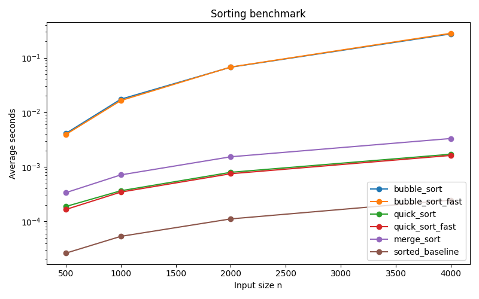

# 6/11 排序效能實驗室

## Stage 4 圖表解讀

`sorted_baseline` 最快，因為它是 Python 內建 Timsort 且底層有高度最佳化。`bubble_sort` 的線在 log scale 下仍明顯比 `quick_sort`、`merge_sort` 更陡，符合 O(n²) 與 O(n log n) 的差異。本次 `quick_sort_fast` 在 4000 筆資料約從 0.00171 秒降到 0.00162 秒，約 1.05x 加速。
