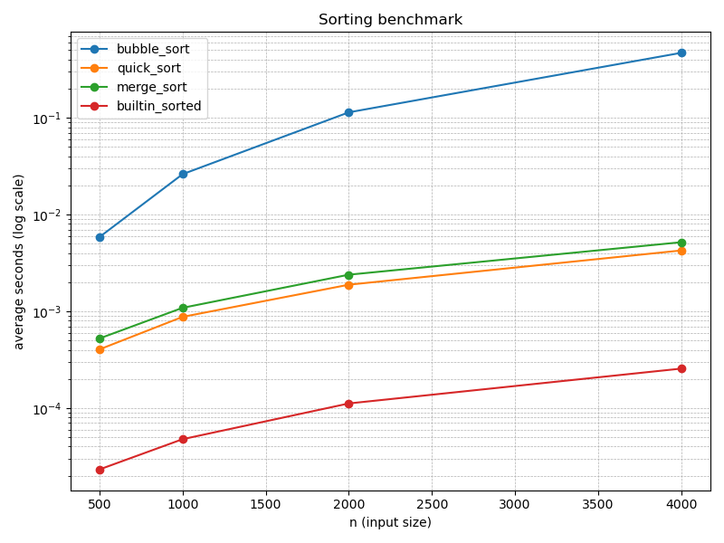

# 0611 排序效能實驗室 — 解題資料夾說明

此資料夾包含本次作業的最小實作與測試、benchmark 結果與圖表。

檔案摘要
- `timing.py`, `sorts.py`, `benchmark.py`, `plot.py`：作業實作與工具。
- `test_timing.py`, `test_sorts.py`：Stage1/Stage2 測試，可用 `python -m unittest -v` 執行。
- `results.json`：`benchmark.py` 產出的數據（sizes, repeats, data）。
- `assets/benchmark.png`：使用 `plot.py` 從 `results.json` 產生的圖表。
- `assets/benchmark.b64.txt`：`benchmark.png` 的 base64 版本（便於內嵌或快速預覽）。
- `AI_LOG.md`, `TEST_LOG.md`：提交所需的紀錄檔範本（請依作業規範填寫）。

如何重現
```powershell
cd weeks/week-16/solutions/1114405017/0611
python -m unittest -v                # 先跑測試 (Stage1/2)
python benchmark.py                  # 執行 benchmark，會產生 results.json
python plot.py                       # 產生 assets/benchmark.png
```

`results.json` 結構說明
- `sizes`: list[int] — 被測輸入大小
- `repeats`: int — 每個大小重複次數
- `data`: dict — 每個排序名稱對應到 list[float]（對應 sizes 的平均耗時）

範例一行：
```json
"data": { "merge_sort": [0.0005, 0.0010, 0.0024, 0.0051] }
```

快速看圖



若你想要把圖直接內嵌到其他 Markdown（例如 README）可使用 `assets/benchmark.b64.txt` 中的 base64 字串。

-----
如需我幫忙將 `results.json` 轉成表格或產生更多 runs（不同 sizes/repeats），告訴我你想要的參數，我會幫你跑並更新檔案。
