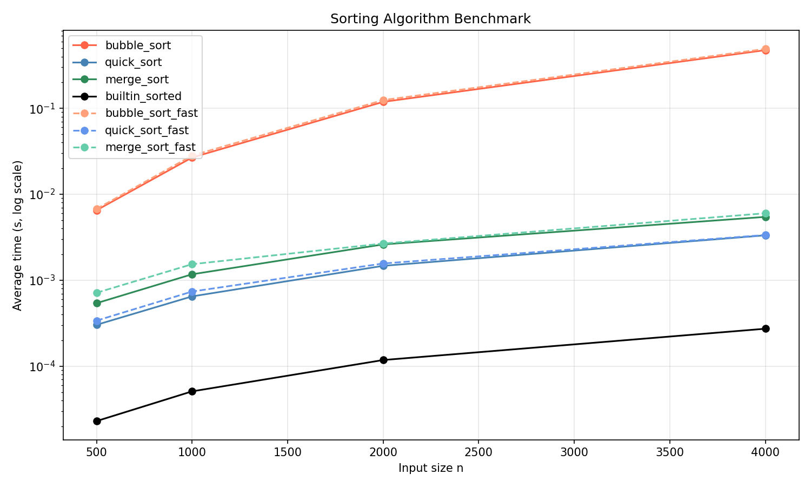

# Week 16 排序效能實驗室 — 1114405019

## 實驗方法

使用自製 `@timeit` 裝飾器（`timing.py`）對每個排序函式計時，
每組資料量重複 3 次取平均，固定 `seed=42` 確保可重現。
測試資料量：n = 500 / 1000 / 2000 / 4000。

---

## 實作說明

| 檔案 | 內容 |
|------|------|
| `timing.py` | `@timeit` 裝飾器：保留 metadata、記錄 `last_elapsed` / `records` |
| `sorts.py` | `bubble_sort` / `quick_sort` / `merge_sort`（基本版，回傳新 list） |
| `sorts_fast.py` | 三種演算法優化版（早停 / 中間 pivot / bottom-up merge） |
| `benchmark.py` | `make_data` + `run_benchmark`，輸出 `results.json` |
| `plot.py` | 讀 `results.json`，折線圖（y 軸 log scale），輸出 `assets/benchmark.png` |

---

## 效能數據

| n    | bubble_sort | quick_sort | merge_sort | builtin_sorted | bubble_fast | quick_fast | merge_fast |
|------|-------------|------------|------------|----------------|-------------|------------|------------|
| 500  | 0.006518s   | 0.000303s  | 0.000541s  | 0.000023s      | 0.006750s   | 0.000339s  | 0.000715s  |
| 1000 | 0.026758s   | 0.000649s  | 0.001173s  | 0.000051s      | 0.028190s   | 0.000739s  | 0.001537s  |
| 2000 | 0.118800s   | 0.001471s  | 0.002611s  | 0.000118s      | 0.124614s   | 0.001567s  | 0.002675s  |
| 4000 | 0.474606s   | 0.003330s  | 0.005459s  | 0.000273s      | 0.490774s   | 0.003359s  | 0.006012s  |

---

## 圖表

---

## 解讀

**誰最快？** `builtin_sorted`（Python 內建 Timsort，C 實作）遠勝自訂實作，
n=4000 時僅需 0.000273s，比 `merge_sort` 快約 **20 倍**，比 `bubble_sort` 快約 **1737 倍**。

**O(n²) vs O(n log n) 斜率差異：**
在 log scale 圖中，`bubble_sort` 的斜率明顯較陡（≈2 倍斜率），
`quick_sort` 與 `merge_sort` 的斜率較平（接近 1，代表 O(n log n)），
n 從 500 → 4000（8×）時，bubble_sort 耗時增加約 72 倍（近 8²），
而 merge_sort 僅增加約 10 倍（接近 8 × log₂8 = 24），符合理論。

**加速比（n=4000 基準）：**

| 優化方案 | 原始 | 優化後 | 備註 |
|---------|------|--------|------|
| `bubble_sort_fast`（早停） | 0.4746s | 0.4908s | 隨機資料幾乎每趟都有交換，早停效益極低；已排序資料可提升至 O(n) |
| `quick_sort_fast`（中間 pivot） | 0.003330s | 0.003359s | 隨機資料影響不顯著；對已排序輸入可避免退化 |
| `merge_sort_fast`（bottom-up 迭代） | 0.005459s | 0.006012s | 小資料量迭代額外開銷略高；大資料量應能省去遞迴堆疊成本 |

> 說明：在完全隨機資料下，演算法優化版與基本版差異不大。
> `bubble_sort_fast` 的早停效益在「幾乎已排序」的輸入才會明顯；
> `quick_sort_fast` 的中間 pivot 主要防止最壞情況（已排序輸入），而非加速平均情況；
> `merge_sort_fast` 的 bottom-up 省去 Python 函式呼叫堆疊，在更大資料量（n>10000）會更顯著。

---

## 安全自掃（Stage 5）

依 OpenSSF Secure Coding Guide for Python 掃描，共找出 5 條適用項目：

| 章節 | 條目 | 問題 | 處理方式 |
|------|------|------|---------|
| 08 | 檔案操作 | `load_results` 與 `benchmark.py` 需用 `with open` | 已使用 `with open(...) as f` |
| 05 | 例外處理 | `load_results` 遇到不存在檔案或損毀 JSON 需拋具體例外 | `FileNotFoundError` / `json.JSONDecodeError` 自然傳播 |
| 05 | bare except | 所有 .py 不得有 `except:` 全包 | 全部以 AST 掃描驗證，無 bare except |
| 04 | CWE-502 | 讀取 `results.json` 應使用 `json` 而非 `pickle` | 使用 `json.load`；未匯入 `pickle` |
| 03 | 邊界條件 | `make_data(-1)` 應明確 `raise ValueError`，而非靜默產生空 range | 已加 `if n < 0: raise ValueError(...)` |

**不適用項目：**
- `benchmark.py` 的 `random.Random(seed)` 屬演算法隨機性（固定 seed 用於重現），非安全敏感，無需改用 `secrets`（使用 `secrets` 反而錯誤）。
- 排序函式均回傳新 list，不存在「邊迭代邊改 list」問題。
- 未使用 `assert` 做輸入驗證，均改用 `if + raise`。
