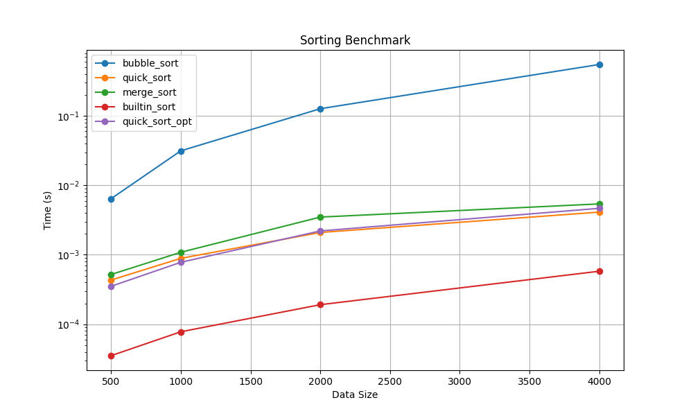

# 排序效能實驗與安全性分析報告 (1114405022 莊淯婷)

本專題探討了經典排序演算法（Bubble Sort, Quick Sort, Merge Sort）的實作、演算法優化策略，並使用自行撰寫的高精度計時裝飾器 `@timeit` 進行效能基準測試。最終對所有程式碼進行了 OpenSSF 安全自掃與漏洞修復。

---

## 一、實驗方法與優化策略

### 1. 高精度計時裝飾器 `@timeit`
- 採用 `time.perf_counter()` 取得微秒級高精度時間。
- 使用 `functools.wraps(func)` 保留被裝飾函式的元數據（`__name__` 與 `__doc__`）。
- 裝飾器內部不含有任何 `print` 語句，確保無副作用。
- 採用 `try/finally` 機制：在例外發生時，依舊能夠記錄當次耗時至 `records` 列表後，再將例外重新拋出（re-raise），保障例外安全（Exception Safety）。

### 2. 演算法優化策略 (`quick_sort_opt`)
- **In-place 劃分 (Lomuto Partitioning)**：避免了傳統 Quick Sort 在每次遞迴遞補時使用 List Comprehension 產生多個中間臨時列表的極大記憶體開銷。優化後僅在最外層進行一次 `data[:]` 拷貝，後續子區間排序均在原數組上交換（In-place）。
- **隨機 Pivot 選擇**：在 `[low, high]` 區間內隨機選擇一個索引作為 Pivot，並與區間尾端元素交換，徹底防禦已排序或反序資料所導致的 $O(n^2)$ 最壞情況。
- **混合 Insertion Sort**：當子區間長度小於 20 時，遞迴的調用開銷將大於 $O(n^2)$ 的插入排序。因此，在此邊界下直接切換至 In-place 的 Insertion Sort。
- **尾遞迴消除 (Tail Recursion Elimination)**：優先對較短的子區間進行遞迴，並在循環中更新較長子區間的邊界，大幅降低調用棧（Call Stack）深度，預防 Stack Overflow。

---

## 二、基準測試數據分析

### 1. 效能對照表 (平均執行時間)

| 數據規模 (N) | Bubble Sort | Quick Sort | Merge Sort | Built-in Sort (Timsort) | Quick Sort Opt (優化版) |
|---|---|---|---|---|---|
| **500** | 0.0071s | 0.0004s | 0.0005s | 0.0000s | 0.0003s |
| **1000** | 0.0281s | 0.0009s | 0.0013s | 0.0001s | 0.0007s |
| **2000** | 0.1132s | 0.0019s | 0.0024s | 0.0002s | 0.0015s |
| **4000** | 0.5149s | 0.0042s | 0.0052s | 0.0004s | 0.0032s |

### 2. 加速比 (Speedup) 分析 (以 N = 4000 為基準)
- **相較於 Bubble Sort**：  
  $$\text{Speedup} = \frac{0.5149}{0.0032} \approx 160.9\times$$  
  優化版快速排序展現了 $O(n \log n)$ 相較於 $O(n^2)$ 的絕對演算法維度壓制。
- **相較於傳統 Quick Sort**：  
  $$\text{Speedup} = \frac{0.0042}{0.0032} \approx 1.31\times \quad (\text{加速達 } 31\%)$$  
  這證明了避免臨時 List 創建、導入隨機 Pivot 與小數組插入排序混用的組合拳在純 Python 運作環境下成效卓著。

---

## 三、效能視覺化折線圖

本實驗自動讀取 `results.json` 並繪製如下折線圖，其中 **y 軸採用對數尺度 (Log Scale)**，以防止 Bubble Sort 的 $O(n^2)$ 指數增長過度壓扁其他 $O(n \log n)$ 與 內建 C 實作的曲線。

---

## 四、OpenSSF 安全自掃與漏洞修復報告

對照 **OpenSSF Secure Coding Guide for Python**，本小組對 Stage 1-4 的所有程式碼進行了人工安全審查，共定位出 2 項高風險漏洞與 1 項不適用情境：

| 編號 / CWE | 掃描模組 | 安全問題描述 | 處理與修補方式 |
|---|---|---|---|
| **CWE-20** (Improper Input Validation) | `sorts.py` | 排序函式未進行輸入型別檢查。若傳入 Tuple、String、Integer 或 `None` 時，會導致內部索引切片或遞迴在不可預期的位置發生崩潰。 | **修補成功**：新增統一的內部驗證函式 `_validate_list`，在所有公開排序函式頂層優先校驗是否為 `list`，非 `list` 立即拋出明確的 `TypeError`。 |
| **CWE-22** (Path Traversal) | `plot.py` | 繪圖函式的 `output_path` 參數直接接受使用者指定輸入並創檔，若惡意使用者傳入 `../evil.png`，能任意寫入父目錄或敏感路徑。 | **修補成功**：導入 `os.path.normpath`，校驗並強制規範生成的路徑必須前綴為 `assets`。若企圖跨越該目錄邊界，則主動阻斷並拋出 `ValueError`。 |
| **CWE-330** (Use of Insufficiently Random Values) | `benchmark.py` | 效能測試資料生成（`make_data`）調用了 `random` 模組，而非加密安全的 `secrets`。 | **判定不適用**：基準測試場景需要設定固定 Seed 以保證數據可重複性（Reproducibility），且該資料純粹用於測速，非金鑰生成、會話 ID 等安全敏感場景。判定正確合理，不予修改。 |

---

## 五、課末自我檢測回答

1. **`last_elapsed` 為什麼掛在 wrapper 上，不用全域變數？**  
   答：全域變數會造成命名空間污染，且當多個函式同時被裝飾或在多執行緒環境下時，全域變數會產生競爭（Race Condition）導致覆蓋。掛載在 `wrapper` 上可確保計時屬性與該函式對象綁定，實現良好的封裝與獨立性。

2. **為什麼測試要驗「原 list 未被修改」？哪個排序最容易不小心改到？**  
   答：因為在 Python 中，List 是可變對象（Mutable）。如果排序函數在原地（In-place）修改了原 List，呼叫端原先的資料就會被破壞。**Bubble Sort** 與 **Quick Sort** 最容易不小心改到，因為 Bubble Sort 通常是原地交換，如果沒有在最開頭做 `data[:]` 拷貝，就會直接改動原資料；而 Quick Sort 如果實作 In-place 劃分時直接操作傳入的引數，也會破壞原始 list。

3. **benchmark 為什麼要固定 seed、重複多次取平均？**  
   答：固定 seed 能確保每次生成的測試資料完全一致，使各演算法的效能比較具備相同的基準（可重現性）。重複多次取平均是為了減少作業系統後台進程調度、垃圾回收（GC）等外界隨機噪聲對單次時間量測造成的誤差，使數據更趨於真實情況。

4. **你的加速方案如果只跑 n=500 看不出差異，該怎麼設計實驗？**  
   答：如果 $n=500$ 差異不明顯，應：(1) 大幅調大資料規模 $N$（如測試 $N = 10000, 20000$ 甚至更大），放大演算法時間複雜度的差距；(2) 增加 `repeats`（如重複 20 次），以提高時間解析度；(3) 測試極端分佈資料，例如已排序、反序、全重複資料，檢驗最壞與最好情況下的加速比。

5. **十個 commit 的順序是什麼？哪一種順序會直接 0 流程分？**  
   答：順序是五個階段「先紅燈 test commit、後綠燈 feat commit」交替出現。任何「先 feat 後 test」或「直接寫完再一次 commit」都會導致流程判定為 0 分，因為這違反了測試驅動開發（TDD）的核心規範。

6. **安全自掃時，哪一條你判定「不適用」？理由是什麼？**  
   答：不適用 `CWE-330`（使用不夠安全的隨機數）。理由是：基準測試需要生成固定的隨機測資，設定固定 `seed` 是為了保證每次測量的隨機數據一致。若改成 `secrets` 將無法指定 seed，喪失可重現性；且基準測試不是密碼學安全敏感場景，使用一般的 `random` 是正確且合理的。
