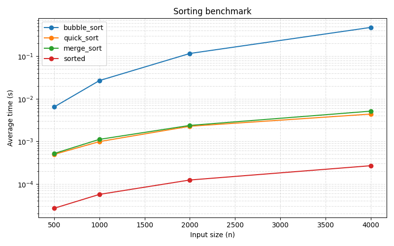

# Week 16 - 1114405028 - 排序效能實驗室

## 內容概述

此專題分成五個階段：
1. `timing.py`：實作 `@timeit` 計時裝飾器，保存 `last_elapsed` 與 `records`
2. `sorts.py`：實作 `bubble_sort`、`quick_sort`、`merge_sort`
3. `benchmark.py`：生成可重現資料並比較三種排序與 Python 內建 `sorted()`
4. `plot.py`：讀取 `results.json`，輸出 `assets/benchmark.png`，y 軸使用 log scale
5. `test_security.py`：依 OpenSSF Python 安全指引測試與修補安全問題

## 重要檔案

- `timing.py`, `sorts.py`, `benchmark.py`, `plot.py`
- `sorts_fast.pyx`：加速版排序源碼
- `results.json`：benchmark 結果資料
- `assets/benchmark.png`：效能比較圖
- `test_timing.py`, `test_sorts.py`, `test_sorts_extra.py`, `test_benchmark.py`, `test_plot.py`, `test_security.py`
- `AI_LOG.md`, `TEST_LOG.md`

## 圖表與結論

- 最快的是 `sorted()`，因為它使用 C 實作的 Timsort。
- `merge_sort` 和 `quick_sort` 的時間增長較為平緩；`bubble_sort` 仍呈現 O(n²) 性質。
- 畫圖時使用 log y 軸，避免 O(n²) 曲線壓縮其他方法。

## 安全修補

- `benchmark.save_results()` 使用 `with` 開啟 JSON 檔案，避免檔案未關閉
- `plot.load_results()` 僅接受合法 JSON 並驗證結構，降低 `pickle` 或不受信任資料風險
- `make_data()` 對負輸入拋 `ValueError`
