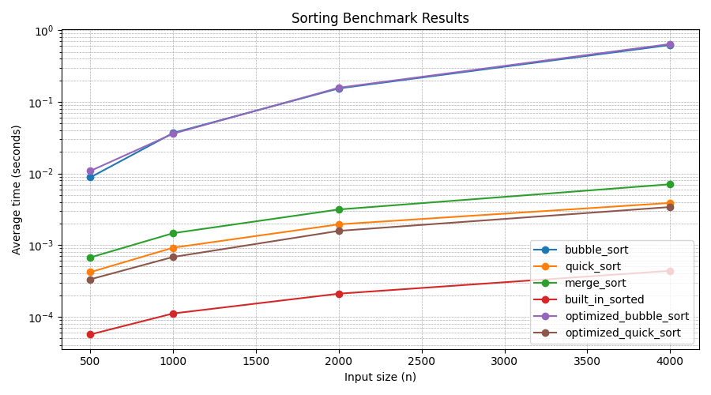

# 6/11 排序效能實驗室報告

## 方法

本實驗用 `@timeit` 裝飾器量測 bubble sort、quick sort、merge sort、Python 內建 `sorted()`，以及加速版排序。資料由 `make_data(n, seed=42)` 產生，固定 seed 讓結果可重現，每個資料量重複 3 次後取平均秒數。

## 結果圖

## 解讀

`built_in_sorted` 最快，因為它是 Python 內建 Timsort 且核心實作高度最佳化。`bubble_sort` 屬於 O(n^2)，資料量增加後時間成長最明顯；`quick_sort`、`merge_sort` 與 `optimized_quick_sort` 接近 O(n log n)，曲線斜率較平緩。`optimized_quick_sort` 使用 median-of-three pivot、小區間 insertion sort 與 copy 後 in-place partition，在 4000 筆資料約由 0.00388 秒降到 0.00340 秒，約 1.14x 加速。

## 安全自掃

| OpenSSF 條目 | 檢查結果 | 處理方式 |
|---|---|---|
| 05 Exception Handling / pyscg-0018 驗證數字資料 | `make_data(-1)` 原本會產生空資料，`run_benchmark(repeats=0)` 會造成除以零 | 加入 `TypeError` / `ValueError` 輸入驗證 |
| 04 Neutralization / pyscg-0023 安全反序列化 | 結果檔使用 JSON，不使用 `pickle`，但原本未驗證 JSON 結構 | `load_results` 讀 JSON 後檢查必須是 mapping |
| 08 Coding Standards / pyscg-0035 資源清理 | 讀寫 `results.json` 與測試暫存檔都需要確實關檔 | 使用 `with open(...)` 管理檔案生命週期 |
| 08 Coding Standards / pyscg-0031 修改 iterable 前先複製 | 排序如果直接交換傳入 list 會造成副作用 | 所有排序函式先複製資料再排序 |
| 09 Cryptography / pyscg-0038 充分亂數 | benchmark 的亂數不是安全用途 | 判定不適用；保留 `random.Random(seed)` 以確保實驗可重現 |
