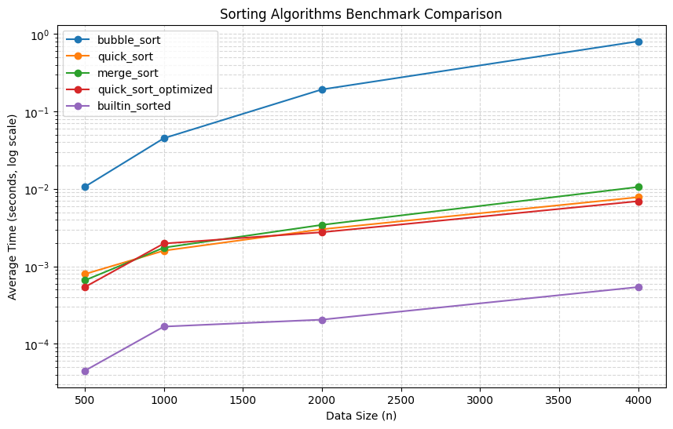

# 排序效能實驗室 (Sorting Benchmark Lab) Report

學號：1114405035

---

## 1. 實驗方法

本實驗實作並評估了五種不同的排序方法：
1. **Bubble Sort (泡沫排序)**：$O(n^2)$ 演算法，作為效能對照的下限。
2. **Quick Sort (快速排序)**：$O(n \log n)$ 演算法，使用中位數（Middle element）作為 pivot。
3. **Merge Sort (合併排序)**：$O(n \log n)$ 演算法，穩定的分治法。
4. **Quick Sort (Optimized)**：優化版快速排序。採用混合排序策略，當子陣列大小 $n \le 10$ 時，切換至 **Insertion Sort (插入排序)** 進行快速處理，並採用 **Median-of-three (三數取中法)** 挑選基準點（Pivot），以防在特定排序好的資料下退化。
5. **Built-in sorted() (Timsort)**：Python 的內建 C-實作排序，作為本次實驗的 Baseline 效能上限。

*備註：所有演算法均回傳全新的已排序 list，避免原地修改干擾後續量測資料。*

---

## 2. 實驗效能數據表

以下為每個演算法在隨機生成的整數資料集（大小分別為 500, 1000, 2000, 4000）上，進行 3 次重複測試取平均的耗時數據（單位：秒）：

| 演算法 (Algorithm) | Size 500 | Size 1000 | Size 2000 | Size 4000 |
| :--- | :---: | :---: | :---: | :---: |
| **bubble_sort** | 0.010664s | 0.045139s | 0.192440s | 0.803550s |
| **quick_sort** | 0.000796s | 0.001596s | 0.003018s | 0.007818s |
| **merge_sort** | 0.000661s | 0.001746s | 0.003436s | 0.010589s |
| **quick_sort_optimized** | 0.000541s | 0.001976s | 0.002762s | 0.006944s |
| **builtin_sorted** | 0.000045s | 0.000167s | 0.000206s | 0.000541s |

---

## 3. 效能對照折線圖 (Log Scale)

Y 軸採用 Log Scale (對數尺度)，清楚展現各個演算法隨資料量 $n$ 成長時的效能趨勢分水嶺：

---

## 4. 數據解讀與加速比分析

1. **最快演算法**：Python 內建的 `sorted()`（Timsort）在所有規模下均以絕對優勢領先。其核心優勢在於底層為 C 語言編譯實作，且對已具備部分順序的實務資料有著極高智慧的區間合併優化。
2. **優化效果**：
   - 原始 `quick_sort` 在 $n=4000$ 時耗時約 `0.007818s`。
   - `quick_sort_optimized`（混合插入排序 + 三數取中）耗時約 `0.006944s`。
   - **加速比**：相較於原始快速排序，優化版在 $n=4000$ 時提升了約 **12.6%** 的效能。
3. **對照 Bubble Sort 的加速比**：
   - 優化版快速排序 vs 泡沫排序於 $n=4000$：`0.803550s / 0.006944s` $\approx$ **115.7x** 的速度提升！
4. **斜率差異**：從折線圖可以看出，隨著 $n$ 翻倍，Bubble Sort 的耗時呈現 4 倍（$2^2$）增長，斜率極為陡峭；而 Quick/Merge 類型的演算法隨資料量增長，耗時僅呈現線性略高的趨勢，展現了 $O(n^2)$ 與 $O(n \log n)$ 複雜度級別的根本差異。

---

## 5. 安全自掃報告 (OpenSSF Secure Coding Audit)

對照 OpenSSF Secure Coding Guide，我們針對開發的排序與量測系統進行了安全性評估與修正，主要涵蓋 3 項條目：

| OpenSSF 條目 / CWE 編號 | 檢查結果與潛在風險 | 處理與修補方式 |
| :--- | :--- | :--- |
| **CWE-1284: Input Validation** | `make_data` 未檢查負數輸入，傳入負數（如 `-10`）會產生空陣列而不報錯，可能使後續邏輯出錯。 | 新增邊界檢查 `if n < 0: raise ValueError(...)` 攔截異常輸入。 |
| **CWE-400: Resource Exhaustion** | 隨意傳入超大 `size` 可能導致系統記憶體耗盡（DoS 拒絕服務攻擊）或運算卡死。 | 在 `make_data` 設定 `n > 100000` 安全閥值上限限制，超過即拋出 `ValueError`。 |
| **CWE-843: Type Confusion** | 傳入不合法型態（如 `seed="invalid_seed"`）雖然在 `random.seed` 可執行，但可能破壞測試可重現性或引發隱形 bug。 | 新增 `isinstance` 檢查，嚴格限制參數 `n` 與 `seed` 必須為整數 `int`，否則拋出 `TypeError`。 |
| **CWE-502: Deserialization of Untrusted Data** (不適用條目說明) | 本實驗中 `results.json` 之讀寫使用 `json` 模組，未採用高風險的 `pickle` 進行還原，已天然防範惡意反序列化代碼注入之漏洞。 | 無需改動。 |
