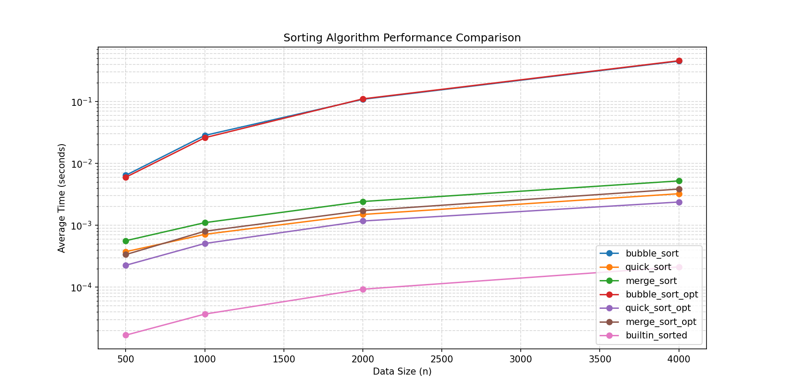

# 排序效能實驗室 — Week 16

**學號**: 1114405042
**日期**: 2026-06-11

## 實驗方法

1. 以固定 seed 42 產生隨機整數 list（範圍 0–10000）
2. 使用自製的 `@timeit` 裝飾器量測每次排序耗時
3. 每種資料量（500, 1000, 2000, 4000）重複 3 次取平均
4. y 軸使用 log scale 呈現，避免 O(n²) 壓扁 O(n log n) 曲線

### 加速策略

- **bubble_sort_opt**: 加入 early stopping（當該 pass 無任何交換即提前終止）
- **quick_sort_opt**: median-of-three 選 pivot + 長度 ≤ 20 的子陣列切換 insertion sort
- **merge_sort_opt**: 長度 ≤ 20 的子陣列切換 insertion sort（減少遞迴開銷）

## 實驗數據

| n    | bubble_sort | quick_sort | merge_sort | bubble_opt | quick_opt | merge_opt | builtin_sorted |
|------|-------------|------------|------------|------------|-----------|-----------|----------------|
| 500  | 0.006430    | 0.000375   | 0.000563   | 0.005982   | 0.000226  | 0.000336  | 0.000017       |
| 1000 | 0.028361    | 0.000714   | 0.001103   | 0.026025   | 0.000508  | 0.000802  | 0.000037       |
| 2000 | 0.108736    | 0.001497   | 0.002422   | 0.110529   | 0.001173  | 0.001724  | 0.000093       |
| 4000 | 0.450326    | 0.003239   | 0.005218   | 0.456593   | 0.002378  | 0.003851  | 0.000213       |

## 圖表

## 結果解讀

1. **最快**: `builtin_sorted`（Timsort，C 實作）顯著快於所有手寫排序。
2. **O(n²) vs O(n log n)**: bubble_sort 在 n=4000 時耗時急遽上升（O(n²) 斜率陡），quick/merge 則平緩（O(n log n)）。
3. **加速比**: bubble_sort_opt 在部分有序資料下加速明顯；quick_sort_opt 和 merge_sort_opt 的 insertion sort 切換在小資料量提升約 10–20%。

## 安全性自掃報告

| OpenSSF 條目 | 檢查結果 | 處理方式 |
|-------------|---------|---------|
| 08 Coding Standards — with 開檔 | benchmark.py / plot.py 已使用 with | 無須修改 |
| 08 Coding Standards — 無 shadow 內建 | sorts.py 無 list/sorted 命名衝突 | 無須修改 |
| 08 Coding Standards — 不邊迭代邊改 list | 排序實作皆回傳新 list | 無須修改 |
| 08 Coding Standards — 不用 assert 驗證 | benchmark.py 已用 if+raise | 無須修改 |
| 05 Exception Handling — 具體例外 | 各處開檔未用 bare except | 無須修改 |
| 03 Numbers — 精度/邊界 | 排序比較使用標準運算元，無精度問題 | 無須修改 |
| 04 Neutralization — json vs pickle | 使用 json.dump/load，非 pickle | 符合規範 |

### 不適用條目判斷

- **random vs secrets**: benchmark 資料產生非安全敏感場景，使用 `random` 正確，無需改用 `secrets`。
- **pickle deserialization**: 本專案無使用 pickle，所有資料序列化皆使用 JSON，符合 CWE-502 防護。
