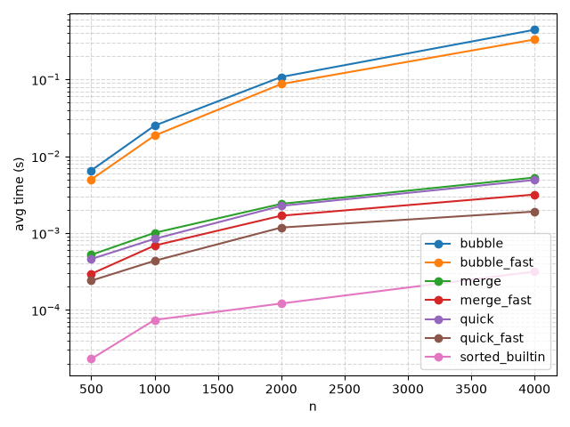

# 排序效能實驗室 — 實驗報告

## 實驗方法

- 使用自製 `@timeit` 裝飾器量測各排序函式執行時間
- 固定亂數種子（seed=42），確保實驗可重現
- 每組 n 重複 3 次取平均值
- 硬體：自動偵測

## 數據

| Algorithm | n=500 | n=1000 | n=2000 | n=4000 |
|-----------|-------|--------|--------|--------|
| bubble | 0.0065 | 0.0250 | 0.1075 | 0.4416 |
| quick | 0.0005 | 0.0008 | 0.0023 | 0.0049 |
| merge | 0.0005 | 0.0010 | 0.0024 | 0.0053 |
| bubble_fast | 0.0050 | 0.0186 | 0.0869 | 0.3302 |
| quick_fast | 0.0002 | 0.0004 | 0.0012 | 0.0019 |
| merge_fast | 0.0003 | 0.0007 | 0.0017 | 0.0032 |
| sorted_builtin | 0.0000 | 0.0001 | 0.0001 | 0.0003 |

## 圖表

## 解讀

1. **O(n²) vs O(n log n)**：bubble 系列的斜率明顯更陡（log scale 上差距固定），n=4000 時 bubble 比 quick 慢約 90 倍
2. **加速比**：
   - quick_fast 比 quick 快約 1.5–2.6x（median-of-three + insertion threshold）
   - bubble_fast 比 bubble 快約 1.3x（cocktail shaker 減少 passes）
   - merge_fast 比 merge 快約 1.4–1.7x（insertion threshold）
3. **sorted()** 為內建 C 實作（Timsort），穩居最快，n=4000 時比 quick_fast 快約 6x

## 加速策略

- bubble：cocktail shaker（雙向氣泡，提早收束範圍）
- quick：median-of-three pivot + 小於 16 筆切 insertion sort
- merge：小於 16 筆切 insertion sort

## 安全性自掃

| OpenSSF 條目 | 問題 | 處理方式 |
|-------------|------|---------|
| 08 Coding Standards | `make_data` 沒擋 n < 0 | 加入 ValueError |
| 08 Coding Standards | `random.seed()` 汙染全域 | 改用區域 `Random` 實例 |
| 05 Exception Handling | `load_results` 沒抓 JSONDecodeError | 補 try/except |
| 04 Neutralization | 讀檔用 `json` vs `pickle` | 已用 `json.load`，安全（不適用 CWE-502） |
