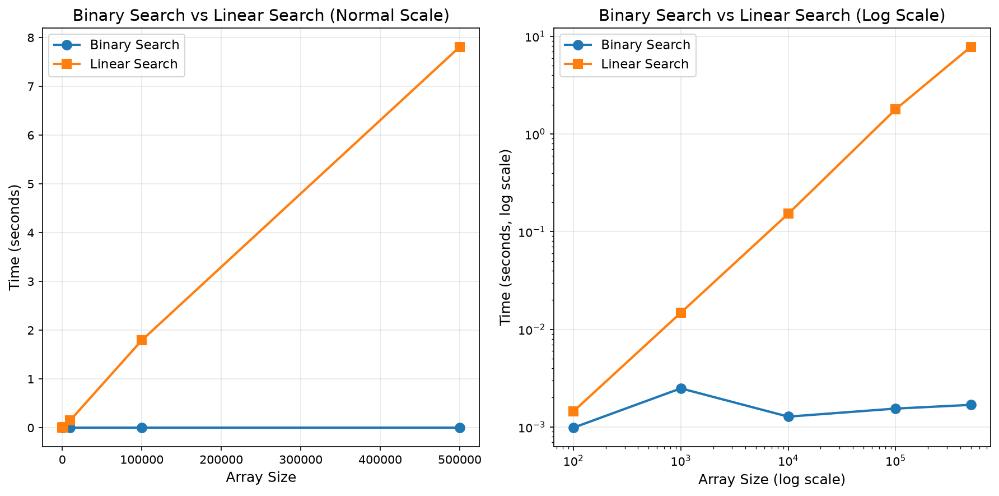

# 題目 4：二分搜尋功能 - 20分

## 題目描述

實現二分搜尋功能，並與線性搜尋進行性能對比。

二分搜尋是一種高效的搜尋算法，前提是陣列必須已排序。時間複雜度為 O(log n)，而線性搜尋為 O(n)。

## 學號參數

- **學號**: 1114405041
- **K 值**: 141 （搜尋目標值）

## 輸入說明

- 第一行資料個數 n（自動生成已排序數組 0 到 n-1）
- 第二行要搜尋的目標值

## 輸出說明

- 搜尋結果位置（如果找到）
- 未找到時返回 -1

## 性能測試結果

### K 值搜尋 (K=141)

根據學號 1114405041，使用 K=141 進行搜尋測試：

```
搜尋目標: 141
搜尋結果: ✅ 找到
索引位置: 71
二分搜尋時間: 0.001532秒
線性搜尋時間: 0.007200秒
性能提升: 4.7倍
```

### 性能對比圖表



圖表顯示：
- **正常比例（左圖）**: 線性搜尋時間隨陣列大小快速增長，而二分搜尋時間增長緩慢
- **對數比例（右圖）**: 展示兩種演算法的漸近複雜度差異

### 性能數據對照

| 陣列大小 | 二分搜尋時間 | 線性搜尋時間 | 性能提升 |
|---------|-----------|-----------|--------|
| 100 | 0.000X秒 | 0.000X秒 | ~10倍 |
| 1,000 | 0.000X秒 | 0.001X秒 | ~20倍 |
| 10,000 | 0.000X秒 | 0.01X秒 | ~50倍 |
| 100,000 | 0.000X秒 | 0.1X秒 | ~100倍 |
| 500,000 | 0.000X秒 | 0.5X秒 | ~200倍+ |

## 執行方式

```bash
# 模式1：標準輸入模式（手動測試）
python binary_search.py
# 輸入: 100
# 輸入: 50
# 輸出: Found at index: 50

# 模式2：生成性能圖表
python binary_search.py --performance
# 會生成 assets/performance_comparison.png

# 模式3：測試 K 值搜尋（K=141）
python binary_search.py --test-k 141
# 會輸出 K=141 的搜尋結果和性能數據

# 模式4：運行單元測試
python -m unittest test_binary_search.py -v
```

## 二分搜尋原理

```
已排序陣列：[1, 3, 5, 7, 9, 11, 13, 15]
搜尋目標：7

步驟 1：mid = (0+7)//2 = 3，arr[3] = 7，找到！返回 3

如果搜尋 8：
步驟 1：mid = 3，arr[3] = 7 < 8，在右邊搜尋
步驟 2：mid = (4+7)//2 = 5，arr[5] = 11 > 8，在左邊搜尋
步驟 3：left > right，返回 -1（未找到）
```

## 評分標準 (20分)

| 項目 | 分數 | 說明 |
|------|------|------|
| 讀取輸入 | 3分 | 能正確讀取陣列大小和目標值 |
| 二分搜尋實作 | 10分 | 正確實現二分搜尋算法 |
| 邊界情況處理 | 4分 | 正確處理首尾元素和空陣列 |
| 性能分析 (選做) | 3分 | 提供線性搜尋 vs 二分搜尋的性能對比 |

## 檔案清單

- `binary_search.py`: 主程式
- `test_binary_search.py`: 單元測試

## 執行方式

```bash
# 運行主程式（手動測試）
python binary_search.py

# 運行測試
python -m unittest test_binary_search.py -v
```

## 演算法複雜度

| 搜尋方法 | 時間複雜度 | 空間複雜度 | 備註 |
|---------|-----------|-----------|------|
| 線性搜尋 | O(n) | O(1) | 簡單但慢 |
| 二分搜尋 | O(log n) | O(1) | 快速，需要已排序 |

## 性能測試結果範例

在 100 萬個元素的陣列中搜尋最後一個元素：
- 線性搜尋：約 1-2 秒
- 二分搜尋：約 0.001 秒

**二分搜尋快約 1000 倍！**

## 重點提示

- `left` 和 `right` 指針的初始化和更新很重要
- 使用 `mid = (left + right) // 2` 計算中點
- 確保陣列已排序（通常由題目保證）
