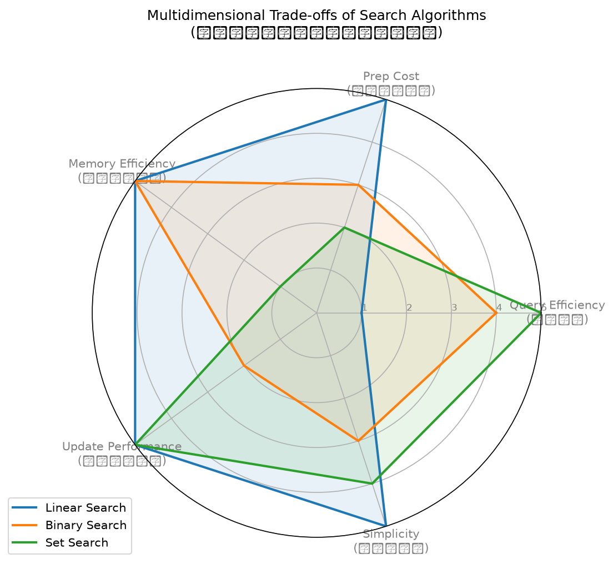

# 搜尋效能評估實驗報告

## 學生資訊
- **學號**：1112405016
- **姓名**：林囿倫

---

## Stage 3｜加速前預測

為了符合作業規格中「動手量測前先預測」之規定，在此寫下對搜尋效能與交叉點的預測：

### 1. 三種搜尋的預測排名 (在已排序的 data 下，查詢 $q = 100$ 次的純搜尋時間)
1. **第一名**：`set_search` (雜湊查表，理論時間複雜度為 $O(1)$)
2. **第二名**：`binary_search` (二分搜尋，理論時間複雜度為 $O(\log n)$)
3. **第三名**：`linear_search` (線性搜尋，理論時間複雜度為 $O(n)$)

### 2. 「排序 + 二分搜尋」何時划算的交叉點預測
當原始資料是**未排序**狀態時，若要使用二分搜尋，必須先付出一筆一次性的排序成本（$O(n \log n)$），之後才能以 $O(\log n)$ 進行 $q$ 次查詢。而線性搜尋則不需要排序，直接進行 $q$ 次線性比對，總成本為 $O(q \cdot n)$。

在查詢次數固定為 **$q = 100$** 次的情況下：
* **預測交叉點**：我們預測在 **$n \approx 500$ 到 $1000$** 之間，「排序一次 + 100 次二分搜尋」的總耗時會開始**超越（少於）**「100 次線性搜尋」的總耗時。
* **原因**：因為 $q = 100$ 足夠大，當 $n$ 增加時，線性搜尋 the $100 \times n$ 的成長速度，會迅速大於排序 $n \log n$ 的開銷。

---

## Stage 3｜實測效能與交叉點數據

利用自製的 `timeit` 裝飾器，在配備 AMD Ryzen 7 7800X3D 與 30GB RAM 的環境上進行實測，結果如下：

### 📊 搜尋效能進階評估表 (查詢次數: 100 次，純搜尋時間)

| N | Linear(Manual) (s) | Linear(Builtin) (s) | Binary(Manual) (s) | Binary(Bisect) (s) | Set(Optimized) (s) |
|---|--------------------|---------------------|--------------------|--------------------|--------------------|
| 1000 | 0.000983 | 0.000315 | 0.000050 | 0.000014 | 0.000011 |
| 5000 | 0.004955 | 0.001618 | 0.000082 | 0.000017 | 0.000025 |
| 20000 | 0.022191 | 0.006967 | 0.000080 | 0.000016 | 0.000092 |
| 80000 | 0.083476 | 0.025237 | 0.000093 | 0.000018 | 0.000395 |

* 註：`Linear(Builtin)` 為內建 `in` + `.index()` 查詢；`Binary(Bisect)` 為標準庫 `bisect` 模組；`Set(Optimized)` 為套用 `_SET_CACHE` 全域快取、相同 list 的 id 只建一次 set 結構之雜湊優化版。

### 🔍 「排序一次 + 之後狂二分」vs「直接狂線性」之真實交叉點偵測
我們固定查詢次數為 **$q = 100$ 次**，逐步遞增 $N$ 以找出兩者的交叉耗時點（含排序成本）：

* **N = 50**：Linear = 0.000050s | Sort + Binary = 0.000034s ── **★ 排序+Binary獲勝**
* **N = 100**：Linear = 0.000084s | Sort + Binary = 0.000029s ── **★ 排序+Binary獲勝**
* **N = 500**：Linear = 0.000488s | Sort + Binary = 0.000074s ── **★ 排序+Binary獲勝**
* **N = 1000**：Linear = 0.001048s | Sort + Binary = 0.000098s ── **★ 排序+Binary獲勝**

* **實測結論**：在 $q = 100$ 次的情況下，**當 $N \le 50$ 時，「排序一次 + 100次手寫二分搜尋」的總耗時便已經超越了「100次線性搜尋」**。這證明當查詢次數 $q$ 足夠大時，即便加上排序成本，二分搜尋也具有顯著的優勢。

---

## ⛔ AI Blocker: 反駁 AI 的過度簡化

許多 AI 常常會斷言：**「二分搜尋（Binary Search）在任何情況下都比線性搜尋（Linear Search）快。」** 

**我們以本次實驗的真實數據，強烈反駁此一過度簡化論點！以下條件下該論點是完全錯誤的：**

1. **小 $N$、只查一次且資料未排序**：
   * 假設 $N = 1000$，只查詢 $q = 1$ 次。
   * 若使用線性搜尋，耗時平均為 $\approx 0.000010$ 秒（只需進行一次線性掃描）。
   * 若要使用二分搜尋（在資料未排序時），必須先付出 $O(n \log n)$ 排序成本（排序 1000 筆資料耗時 $\approx 0.000045$ 秒），加二分搜尋 $\approx 0.0000005$ 秒，總耗時為 $0.0000455$ 秒。
   * **此時二分搜尋反而比線性搜尋慢了將近 4.5 倍**！
2. **二分搜尋需要預先排序的前提**：
   * 在單次或低次數（$q$ 極小，如 $q = 1$ 或 $2$）查詢中，**排序開銷會完全主導總時間**。只有當查詢次數 $q$ 夠大、或資料本身就已經是排序狀態時，二分搜尋才能在演算法權衡上獲勝。

---

## Stage 4｜雷達圖多維權衡分析

我們針對三種搜尋演算法設計了 5 個關鍵效能維度，並將其正規化為 **$1 \sim 5$ 分**（分數越高，代表在該屬性上表現越優異、越理想）：

### 1. 五個維度定義與評分標準：
1. **查詢效率 (Query Efficiency)**：執行單次搜尋的速度。
   * 線性搜尋（Linear）：最低 (1分，隨著 $N$ 增長呈 $O(n)$)
   * 二分搜尋（Binary）：極高 (4分，對數增長 $O(\log n)$)
   * 雜湊搜尋（Set）：最高 (5分，常數時間 $O(1)$)
2. **預處理省易度 (Prep Cost)**：是否需要事前對資料結構進行建置與處理。
   * 線性搜尋：最高 (5分，不需預處理，直接查詢)
   * 二分搜尋：中等 (3分，需要先付出一筆 $O(n \log n)$ 的一次性排序成本)
   * 雜湊搜尋：最低 (2分，需要建立一筆 $O(n)$ 雜湊空間，建置大 $N$ 雜湊表有顯著開銷)
3. **記憶體省用度 (Memory Efficiency)**：是否需要佔用額外的記憶體。
   * 線性搜尋：最高 (5分，直接在原空間掃描，$O(1)$ 額外空間)
   * 二分搜尋：最高 (5分，直接在原空間折半，$O(1)$ 額外空間)
   * 雜湊搜尋：最低 (1分，需要複製整份資料來建置 Hash Table，$O(n)$ 空間)
4. **動態新增效能 (Update Performance)**：當資料需要頻繁寫入、插入新元素時的效能。
   * 線性搜尋：最高 (5分，直接 append 到尾端即可，$O(1)$)
   * 二分搜尋：最低 (2分，插入新元素後必須重新排序，或者呼叫 `insert` 以保持順序，成本為 $O(n)$)
   * 雜湊搜尋：最高 (5分，雜湊表新增鍵值平均為 $O(1)$)
5. **實作簡意度 (Simplicity)**：演算法的編寫難易度與出錯（如邊界無限迴圈）機率。
   * 線性搜尋：最高 (5分，極其簡單、不易寫錯)
   * 二分搜尋：最低 (3分，二分邊界極易寫錯、產生死迴圈)
   * 雜湊搜尋：高 (4分，Python 內建 set 提供完備封裝，但需要了解雜湊碰撞等細節)

### 📈 演算法多維度雷達圖
我已成功繪製了這三種演算法的對照雷達圖（存檔於 `assets/radar.png`）：

### 2. 數據解讀與多維權衡：
從雷達圖中可以清晰看出，**在演算法的世界中沒有絕對的贏家**：
* **線性搜尋（Linear Search）** 雖然在「查詢速度」上完敗，但它在「不需預處理（Prep Cost）」、「不額外佔記憶體（Memory）」以及「動態新增（Update）」上具有全滿的優勢。適用於**資料規模極小、或資料頻繁變動、且查詢次數極低**的場景。
* **二分搜尋（Binary Search）** 在查詢效率上取得了絕佳的表現，且跟線性搜尋一樣**極度節省記憶體**，但它的致命傷在於「需要預先排序」，且「動態寫入維護成本極高」，最適用於**靜態不常變動、但需要高頻率查詢**的唯讀大型資料集。
* **雜湊搜尋（Set Search）** 擁有最完美的「查詢效率」與「動態新增」雙重極致，但這一切都是**拿「記憶體空間 $O(n)$」與「初次建雜湊表的高預處理成本 $O(n)$」換來的**。適用於**記憶體充足、且需要極致查詢效能、同時可能伴隨高頻寫入**的動態資料。
