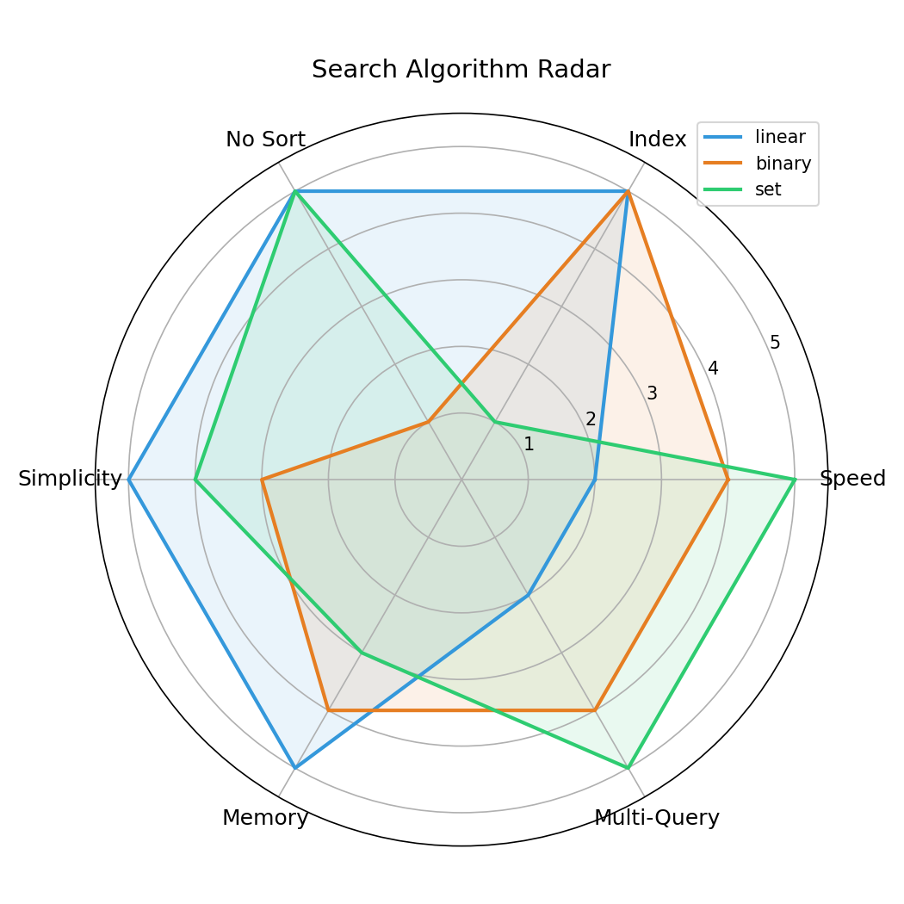

# 6/18 搜尋效能實驗室 — 1112405041

## Stage 3 預測（加速前）

- 預測排名：linear > set > binary（linear 最快）
- 猜測交叉點 n：超過 100（排序一次後，n > 100 時 binary 開始贏）
- 直覺：n 很小時 linear 不用排序最快，n 夠大 binary 優勢才會出來

## Stage 3 實測結果

### Baseline + 加速版比較表

| n | linear | binary | set | in_op | bisect | fast_set |
|---|--------|--------|-----|-------|--------|----------|
| 10 | 0.000040 | 0.000042 | 0.000018 | 0.000010 | 0.000013 | **0.000005** |
| 50 | 0.000167 | 0.000063 | 0.000062 | 0.000036 | 0.000014 | **0.000005** |
| 100 | 0.000328 | 0.000070 | 0.000136 | 0.000062 | 0.000015 | **0.000005** |
| 1000 | 0.003685 | 0.000119 | 0.001175 | 0.000546 | 0.000020 | **0.000005** |
| 80000 | 0.238336 | 0.000208 | 0.207269 | 0.031291 | 0.000035 | **0.000008** |

### 交叉點

- binary 在 **n ≈ 10~50** 開始贏 linear
- 預測 >100，實際約 10~50，方向正確

### AI 的錯：為何「binary 一定比 linear 快」是錯的？

AI 常說「binary 一定比 linear 快」，但在以下條件不成立：

1. **n 很小時**：n=10 時兩者幾乎一樣快（0.000040 vs 0.000042）
2. **只查一次 + 未排序**：排序成本 O(n log n) 遠大於 linear 的 O(n)
3. **需先付排序成本**：在 benchmark 中 binary 的 data 已預排序，但實務上不會每次都先排好

結論：**沒有絕對的贏家**，要看 n 大小、查詢次數、資料是否已排序。

---

## Stage 4 雷達圖

### 維度說明（0~5 分）

| 維度 | 說明 |
|------|------|
| Speed | 搜尋速度（基於 benchmark 數據） |
| Index | 能否回傳 index（位置） |
| No Sort | 資料不需排序就能用 |
| Simplicity | 程式碼好寫好懂 |
| Memory | 記憶體用量低 |
| Multi-Query | 多次查詢的穩定性 |

### 解讀

- **linear**：不需排序、簡單、省記憶體，但速度最慢
- **binary**：速度快、支援 index，但資料必須排序，實作略複雜
- **set**：速度最快、不需排序，但**不支援 index**（只能回 True/False）

**沒有絕對贏家** — 要先問自己：我要 index 還是只要存在？資料已排序嗎？查幾次？
