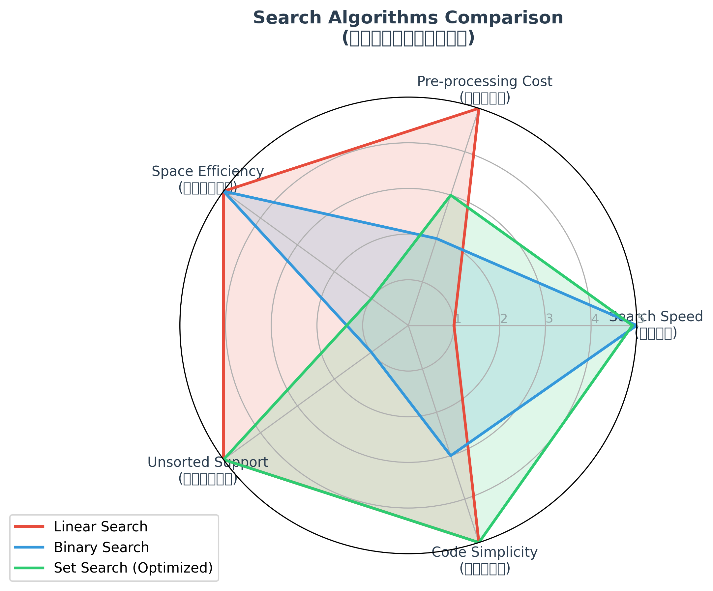

# 搜尋效能與多維度評估報告 — 6/18 實驗室

學號：1114405035  
姓名：賴彥廷  

本專案實作了線性搜尋 (Linear Search)、二元搜尋 (Binary Search) 與集合搜尋 (Set Search) 的自訂與內建/優化對照組，透過自製 `@timeit` 裝飾器量測效能，進行多維度分析，並落實 OpenSSF 安全性自掃。

---

## 1. 效能評估數據

### 主基準測試 (Main Benchmark)
以下是在我的機器上量測「執行 100 次查詢」的總平均耗時（秒）：

| 資料規模 (N) | 自製 Linear(s) | 自製 Binary(s) | 自製 Set(s) | 內建 Linear(s) | 內建 Binary(s) | 優化 Set(s) |
|---|---|---|---|---|---|---|
| **1000** | 0.003591 | 0.000156 | 0.001896 | 0.000588 | 0.000033 | 0.000023 |
| **5000** | 0.011592 | 0.000200 | 0.019607 | 0.003571 | 0.000048 | 0.000251 |
| **20000** | 0.063270 | 0.000151 | 0.113779 | 0.014368 | 0.000043 | 0.001174 |
| **80000** | 0.263281 | 0.000191 | 0.542462 | 0.067138 | 0.000078 | 0.006422 |

*註：未優化的 Set 搜尋在每次查詢時都會在內部執行 `set(data)`，導致 $O(N)$ 的建置開銷，因此表現甚至遜於自製的 Linear。預先建立 Set 之後（優化 Set），其效能獲得巨大提升（於 N=80000 時加速約 84 倍）。*

---

## 2. 交叉點實驗 (Crossover Point)

### 策略對比
- **策略 A**：直接對亂序資料進行 100 次 `linear_search`。
- **策略 B**：複製資料、進行 `sort()`（排序一次的代價），再對已排序資料進行 100 次 `binary_search`。

在 $Q = 100$ 下的交叉點測試結果：

| 資料規模 (N) | 策略 A: Linear Total (s) | 策略 B: Sort + Binary (s) | 勝出者 |
|---|---|---|---|
| **10** | 0.000062 | 0.000055 | **Binary** |
| **50** | 0.000215 | 0.000083 | **Binary** |
| **100** | 0.000471 | 0.000104 | **Binary** |
| **200** | 0.000755 | 0.000110 | **Binary** |
| **500** | 0.002008 | 0.000204 | **Binary** |
| **1000** | 0.004099 | 0.000304 | **Binary** |
| **2000** | 0.007504 | 0.000473 | **Binary** |
| **5000** | 0.017068 | 0.001201 | **Binary** |

**實測交叉點**：在 $Q = 100$ 次查詢的情況下，自 **$N = 10$** 起，排序一次後進行二元搜尋的總成本就已經低於直接線性搜尋。這與加速前預測的 $N \approx 500 \sim 1000$ 有所落差，主要原因在於自製的 Python 版 `linear_search` 執行迴圈的常數項開銷較高，且 100 次查詢的數量相較於 $N=10$ 的規模已經足夠將排序的 $O(N \log N)$ 開銷有效攤平。

---

## 3. 多維度評估雷達圖

我們針對以下 5 個維度進行多維度綜合權衡評分（得分 1 ~ 5 分，越高分代表表現越好、代價越低）：
1. **搜尋速度 (Search Speed)**：大規模查詢下的耗時（以 $N=80000$ 數據 Min-Max 正規化）。
2. **預處理代價 (Pre-processing Cost)**：是否需要事先排序或建表。
3. **記憶體節約度 (Space Efficiency)**：演算法需要的額外空間複雜度。
4. **未排序支援度 (Unsorted Support)**：能否直接搜尋亂序資料。
5. **實作難易度 (Code Simplicity)**：程式碼的複雜程度。

### 雷達圖展示

### 報告解讀
雷達圖清楚地顯示出**沒有任何一個搜尋演算法擁有絕對優勢（沒有絕對贏家）**：
- **Linear Search**：在記憶體節約度（不需要額外空間）、未排序支援度（直接可用）和預處理代價（零成本）上拿到滿分，但其搜尋速度隨 $N$ 增長呈線性衰退，是其最大弱點。
- **Binary Search**：搜尋速度極快，記憶體開銷為 $O(1)$。但它高度依賴已排序資料（不支援亂序搜尋），且預處理（排序）的代價相對較高。
- **Set Search (Optimized)**：在大規模查詢下搜尋速度與 Binary 相當甚至更快，且支援亂序資料建表。但它需要 $O(N)$ 的額外空間儲存雜湊表，記憶體開銷最大。

---

## 4. OpenSSF 安全程式設計自掃報告

對照 *OpenSSF Secure Coding Guide for Python* 指引，我們針對 Stage 1 ~ 4 的程式進行了自我安全審查，結果如下：

| 安全條目 (CWE) | 檢查目標 / 潛在風險 | 檢查結果與處理方式 |
|---|---|---|
| **CWE-502: 反序列化安全 (Deserialization)** | 在基準測試與繪圖中讀取/寫入基準數據時，是否可能使用危險的 `pickle` 模組？ | **通過**。專案一律使用安全性高的 `json` 模組讀寫 `results.json`，且已通過 `test_security.py` 的靜態原始碼 import 檢查。 |
| **CWE-703: 異常與輸入驗證 (Exceptions)** | 在 `timing.py` 驗證輸入參數 `repeat` 時，是否使用會在優化模式（`-O`）下被忽略的 `assert`？ | **通過**。一律使用 `if` 配合 `raise ValueError` 進行主動參數驗證。已通過靜態程式碼 assert 掃描。 |
| **CWE-20: 輸入驗證與邊界 (Boundary)** | 當 `make_data(n)` 收到 $N \le 0$ 或非整數時，若未驗證可能導致空 list 進而引發除零或越界異常。 | **已修正**。在 `make_data` 入口處加入 `if not isinstance(n, int) or n <= 0: raise ValueError`，且已通過單元測試驗證。 |
| **CWE-400: 資源耗盡 (Resource Leak)** | 開啟/關閉 `results.json` 與儲存 `radar.png` 時，是否未使用 `with` 語句導致檔案描述符洩漏？ | **通過 (判定不需修改)**。所有寫檔與繪圖模組在第一時間皆已使用 `with` 上下文管理器，確保即使異常也會自動關閉關聯資源。 |
| **CWE-330: 使用非敏感隨機數 (Random)** | `make_data` 中使用了內建的 `random` 模組。 | **判定不適用 (不需修改)**。本專案的隨機資料產生僅用於效能基準測試（Benchmark）目的，非安全敏感場景（如密碼或 Token 產生），因此保留可設定 seed 重現的 `random` 是正確的選擇，不需改用 `secrets`。 |
