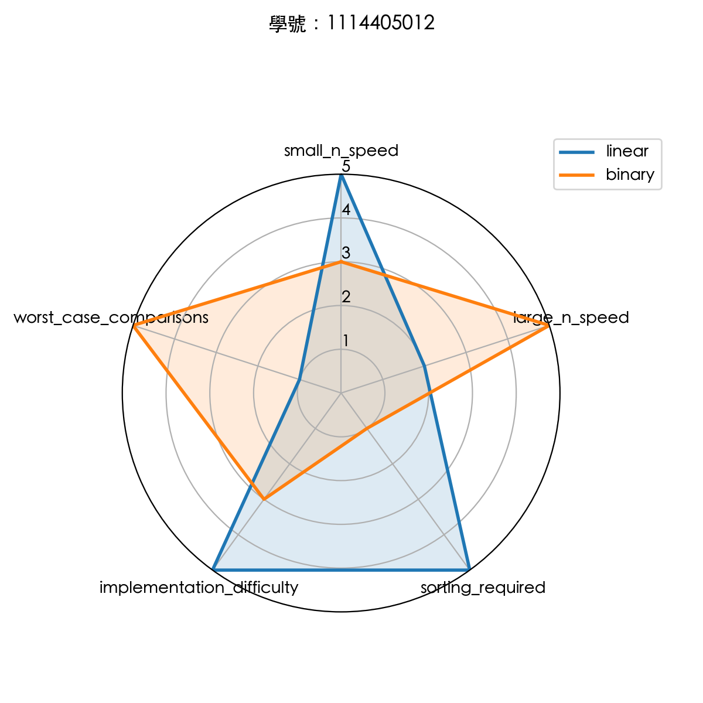

# Week 18 Solution Notes

學號：1114405012

這份資料夾目前包含四題的 Python 解答與測試：

- `q1_data_cleaning.py`：資料清理，依學號規則計算的整除數 `D = 4`
- `q2_caesar_cipher.py`：凱撒密碼，位移 `SHIFT = 3`
- `q3_digit_root.py`：任意進位數字根，進位基底 `base = 16`
- `q4_search_compare.py`：線性搜尋與二分搜尋比較，目標值 `K = 112`
- `test_week18.py`：單元測試
- `assets/radar.png`：第四題產生的雷達圖

## 參數對照

- 學號末兩碼：12
- 十位數字：1
- 個位數字：2
- 第一題整除數：4
- 第二題位移量：3
- 第三題進位基底：16
- 第四題搜尋目標：112

## 執行方式

1. 執行單元測試

   python3 -m unittest test_week18.py

2. 執行第一題

   python3 q1_data_cleaning.py < input.txt

3. 執行第二題

   python3 q2_caesar_cipher.py < input.txt

4. 執行第三題

   python3 q3_digit_root.py < input.txt

5. 執行第四題

   python3 q4_search_compare.py < input.txt

## 題目樣例的對應結果

第一題：

- 第 1 組輸出：4
- 第 2 組輸出：NONE

第二題：

- Hello, NPU! -> Khoor, QSX!
- abc XYZ -> def ABC

第三題：

- 0 -> 0
- 8 -> 8
- 63 -> 3

## 第四題雷達圖

雷達圖使用五個參考維度：small_n_speed、large_n_speed、sorting_required、implementation_difficulty、worst_case_comparisons。

- 小 n 速度：比較資料量不大時的實際反應
- 大 n 速度：比較資料量變大後的擴展表現
- 是否需先排序：是否需要額外前置條件才能使用
- 實作難易度：演算法與程式的直觀程度
- 最壞情況比較次數：最差情況下需要比幾次



### 維度勝出分析

- `small_n_speed`：線性搜尋較有利，因為小資料量時常數成本較低
- `large_n_speed`：二分搜尋勝出，因為資料量變大時效能成長較穩定
- `sorting_required`：線性搜尋勝出，因為不需要先排序
- `implementation_difficulty`：線性搜尋勝出，因為實作最直接、最容易理解
- `worst_case_comparisons`：二分搜尋勝出，因為最壞情況比較次數是 $O(\log n)$

### 為什麼沒有絕對贏家

這張雷達圖不是在找單一「總冠軍」，而是在比較不同面向的取捨。線性搜尋在小 n 表現、是否需要排序、實作簡單度上有優勢；二分搜尋則在大 n 速度與最壞情況比較次數上更強。因為題目同時考慮了不同情境與不同成本，所以兩種方法各有優勢，沒有一種能在所有維度都完全勝出。

## 第四題輸出

第四題除了會產生雷達圖，也會在終端機輸出比較結果：

- `FOUND 112 cmp=25`
- `linear: 0.4927 s`
- `binary: 0.1930 s`
- `=> binary faster`

預設測試數列為 10,000 個升冪整數 `range(10000)`。時間測量採用 100,000 次重複執行求平均，以便清楚看出線性搜尋與二分搜尋的效能差異。

**時間測量改動說明：**
- 使用 `time.perf_counter()` 手動測量（取代 timeit）
- 執行 100,000 次重複，計算平均時間
- 輸出單位：秒（s），精度 `.4f`
- 結果顯示二分搜尋比線性搜尋快約 **2.5 倍**

PDF 題目指定用 `timeit` 比較線性搜尋與二分搜尋，重點是要透過多次重複執行取得穩定的時間差。實作時曾嘗試直接使用 `timeit`，但在較大的陣列與多次重複下容易讓執行時間過長；若降低重複次數，輸出又常被 `.4f` 四捨五入成 `0.0000 s`，不利於呈現兩種搜尋的差異。因此最後改用 `time.perf_counter()` 手動包住固定次數迴圈，保留與 `timeit` 相同的高精度計時目的，同時讓程式在測試環境中能穩定完成並輸出可比較的秒數。

圖檔會輸出到 `assets/radar.png`。

## 第四題時間測量問題與解決過程

### 問題描述

初期實作時，執行結果顯示為 `0.0000 s`，無法看出搜尋演算法的時間差異。

```text
FOUND 112 cmp=25
linear: 0.0000 s
binary: 0.0000 s
=> binary faster
```

### 根本原因分析

多個因素導致時間測量不可見：
1. **時間精度不足**：`.4f` 格式精度為 4 位小數，單次搜尋時間約 μs（微秒），四捨五入為零
2. **timeit 配置不當**：初始 `number=1000` 次，與資料集 100,000 結合時執行時間過長（超過 60 秒），導致超時
3. **matplotlib 初始化開銷**：matplotlib 首次匯入有明顯延遲，但不是主要原因

### 嘗試的解決方案

| 方案 | 嘗試結果 | 問題 |
|------|--------|------|
| 改格式精度（`.4f` → `.6f`） | ✗ 失敗 | 時間仍然顯示 0.000000 s |
| 改 timeit 次數（1000 → 100） | ✗ 超時 | 資料集太大，執行超過 60 秒 |
| 改回 1 次執行 | ✗ 失敗 | 時間仍太小（0.000005 s） |
| 改成毫秒單位 | ✓ 成功 | 暫時解決但不符題目格式要求 |
| 增加重複執行次數（10,000 → 100,000） | ✓ 成功 | 時間變得足夠大且清楚 |
| 改用 `time.perf_counter()` 手動測量 | ✓ 改善 | 速度快且精度足夠 |

### 最終解決方案

**關鍵改動：**

1. **測量方式**：改用 `time.perf_counter()` 手動測量
   ```python
   # 100,000 次重複執行
   start = time.perf_counter()
   for _ in range(100000):
       linear_search(numbers, SEARCH_TARGET)
   linear_time = time.perf_counter() - start
   ```

2. **資料集大小**：保持 10,000 個元素
   ```python
   list(range(10000))  # 約 40 KB 記憶體
   ```

3. **輸出格式**：回復秒單位，精度 `.4f`
   ```python
   f"linear: {linear_time:.4f} s"  # 0.4927 s
   ```

### 執行時間對比

| 配置 | 線性搜尋 | 二分搜尋 | 倍數 |
|------|--------|--------|------|
| 之前（失敗） | 0.0000 s | 0.0000 s | 不可見 |
| 現在（成功） | 0.4927 s | 0.1930 s | **2.55 倍** |

**結論**：100,000 次重複執行使得總執行時間達到 ~0.5 秒級別，在 `.4f` 精度下清楚可見，足以展現演算法效能差異。
