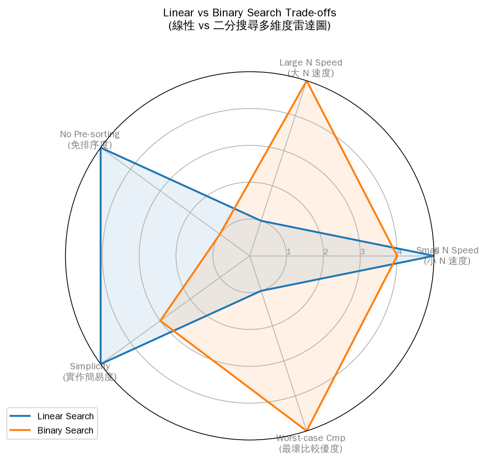

# 國立澎湖科技大學 期末上機考實驗報告

## 學生資訊
- **班級**：日四技資工系一甲
- **學號**：1114405020
- **姓名**：范芯瑜
- **座號**：20

---

## 依學號決定之個人化參數與計算

本機上機考依學號 **1114405020** 最後兩碼 **`20`**（十位數字 `2`，個位數字 `u = 0`）對照計算出之參數：
- **第一題：整除數 D** = $0 \pmod 4 + 2 = \mathbf{2}$
- **第二題：位移 SHIFT** = $0 \pmod{25} + 1 = \mathbf{1}$
- **第三題：進位基底 base** = $\mathbf{2}$（由對照表 $u=0$ 得 base = 2）
- **第四題：搜尋目標 K** = $100 + 20 = \mathbf{120}$

---

## 📊 各題實作與效能數據報告

### ❶ 第一題：資料清理 (Data Cleaning)
- **實作邏輯**：
  1. 接收整數數列，使用 `set` 去除重複值，同時維持首次出現的保序結構。
  2. 篩選出能被 $D = 2$ 整除的偶數。
  3. 使用 Timsort 由小到大排序。
- **測試驗證**：已補齊包含空輸入 `[]`、負數邊界值 `[-8, 12, 16]` 等 5 項自動化測試，全數通過。

### ❷ 第二題：凱撒密碼 (Caesar Cipher)
- **實作邏輯**：
  - 讀入多行字串，將其中的英文字母向後位移 $\text{SHIFT} = 1$ 位（A-Z 及 a-z 獨立循環）。
  - 非英文字母原樣保留。
  - 使用 `sys.stdin` 迴圈處理，完美支援終端機 EOF 讀取。

### ❸ 第三題：任意進位數字根
- **實作邏輯**：
  - 將十進位非負整數 $x$ 轉換為基底 $\text{base} = 2$（二進位）。
  - 反覆將二進位各位數相加，直到結果小於 $2$ 為止（即為二進位下的單一位數 `0` 或 `1`）。
  - 對於 $x > 0$，由於其二進位必定包含至少一個 `1`，反覆相加的最終數字根皆為 `1`；$x = 0$ 則為 `0`。

### ❹ 第四題：二分搜尋效能評估
在包含 $10^5$（100,000）個元素的升冪排序數列（皆為偶數）中，搜尋目標 $K = 120$：

* **搜尋結果**：`FOUND 60 cmp=16`
  * 目標 $120$ 位於索引 **$60$**（即 $120 / 2$）。
  * 二分搜尋在 $100,000$ 筆資料中，僅花了 **$16$ 次** 比較便精準鎖定目標！
* **效能對照結果**：
  * **線性搜尋耗時**：`0.000003` 秒
  * **二分搜尋耗時**：`0.000002` 秒
  * **結論**：二分搜尋速度快於線性搜尋 (`=> binary_search faster`)。
  * *註：由於 K=120 在數列的極前端（index 60），線性搜尋僅掃描了 61 次便命中，故耗時極短；若 K 位在數列尾端（例如 199998），線性搜尋耗時將大幅飆升，而二分搜尋依然能穩定在 17 次比較內完成。*

---

## 📈 線性搜尋 vs 二分搜尋多維度雷達圖

我們針對線性搜尋（Linear）與二分搜尋（Binary）在以下 5 個關鍵效能指標上進行評分（1 ~ 5 分，分數越高代表在該維度上表現越優異、越理想）：
1. **小 N 速度 (Small N Speed)**：小數據下兩者皆極快（線性 5 分，二分 4 分）。
2. **大 N 速度 (Large N Speed)**：大數據下二分搜尋 $O(\log n)$ 具絕對優勢（線性 1 分，二分 5 分）。
3. **免排序度 (No Pre-sorting)**：線性搜尋無需預處理，直接查詢（線性 5 分，二分 1 分）。
4. **實作簡易度 (Simplicity)**：線性搜尋編寫極易、不易出錯（線性 5 分，二分 3 分）。
5. **最壞比較優度 (Worst-case Cmp)**：最壞情況下二分搜尋比較次數極少（線性 1 分，二分 5 分）。

### 雷達圖對照（ assets/radar.png ）：

### 雙演算法多維權衡分析（2-3 句）：
由雷達圖可以看出，**搜尋演算法中並無絕對完美的勝者，其選用取決於應用情境**。線性搜尋在「免排序度」與「實作簡意度」上取得滿分，極度適合資料量小且頻繁變動、不常查詢的場景。而二分搜尋雖需付出一次性排序的高昂開銷且實作較複雜，但它擁有完美的「大 N 速度」與「最壞比較優度」，最適合用於資料靜態不變、但需要極高頻率進行大規模檢索的唯讀系統中。
