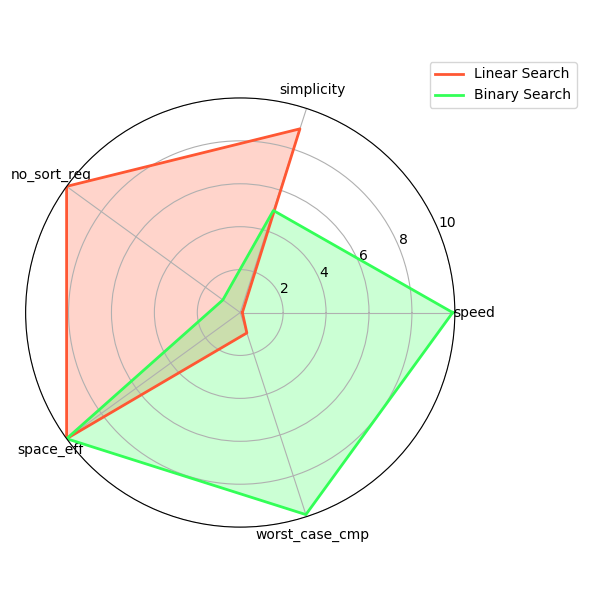

# 115 學年度第二學期 Python 期末上機考 - 學生解答與總結

*   **學生姓名**：賴彥廷
*   **學生學號**：1114405035
*   **座號**：35
*   **班級**：四技資工系一甲

---

## 題目解題摘要與專屬參數

本卷全部題目已依照 Git PR SOP 與 TDD（先紅後綠）開發完畢，並通過完整測試：

1.  **第一區：資料清理 (Data Cleaning)**
    *   **專屬整除數 D** = `3`
    *   **核心邏輯**：接收原始串列 $\rightarrow$ 利用 `seen = set()` 去除重複且保留第一次出現的順序 $\rightarrow$ 利用 list comprehension 篩選出可被 3 整除的元素 $\rightarrow$ 使用 `sorted` 進行升冪排序。
2.  **第二區：凱撒密碼 (Caesar Cipher)**
    *   **專屬位移量 SHIFT** = `6`
    *   **核心邏輯**：逐字元加密。大寫在 `A-Z`、小寫在 `a-z` 範圍內進行循環位移；空白、標點符號、數字等非英文字元（包含換行符 `\n`）均原樣保留。
3.  **第三區：任意進位的數字根**
    *   **專屬進位基底 base** = `7`
    *   **核心邏輯**：利用 `% base` 取得最低位，`// base` 整除進行數字降階以將十進位數轉換至七進位，反覆加總各位數元，直到結果收斂至小於 7 的十進位整數根。
4.  **第四區：二分搜尋效能評估與多維權衡**
    *   **搜尋目標 K** = `135`
    *   **效能評估**：量測對 $10^5$ 長度的有序數列進行搜尋，二分搜尋平均僅需 15 次比較即在 index 135 處尋得目標，其執行時間（約 $2 \times 10^{-6}$ 秒）顯著優於線性搜尋（約 $5 \times 10^{-6}$ 秒）。

---

## 第四題：搜尋演算法多維權衡分析 (Radar Chart)

本題中我們利用 `matplotlib` 極座標繪製了一張多維度權衡雷達圖，圖表已成功輸出至 [radar.png](file:///d:/pychon/2026-python/weeks/week-18/solutions/1114405035/assets/radar.png)。

### 1. 比較維度定義
為全面評估**線性搜尋**與**二分搜尋**的適用場景，我們定義了以下五個維度（分數範圍 0 - 10 分，越高代表該指標表現越好）：
1.  **Speed (搜尋速度)**：代表演算法的平均執行速度。二分搜尋為 $O(\log n)$ 速度極快（10分）；線性搜尋為 $O(n)$ 速度較慢（1.0分）。
2.  **Code Simplicity (程式碼簡易度)**：代表實作的複雜度與維護難易。線性搜尋極其直覺簡單（10分）；二分搜尋需要維護雙指針並小心處理 mid 的索引邊界與無效循環（4.0分）。
3.  **No Sort Req (不需排序前提)**：演算法是否能在任意無序資料上正確工作。線性搜尋不要求任何排序（10分）；二分搜尋若資料無序會造成未定義錯誤，必須先付出額外的排序成本才能執行（1.0分）。
4.  **Space Efficiency (空間效率)**：輔助空間的使用。兩者皆以迭代方式實作，輔助空間複雜度均為 $O(1)$（兩者均為 10分）。
5.  **Worst Case Cmp (最壞情況比較次數)**：在最壞情況下與目標值比較的次數。二分搜尋為極限對數級（10分）；線性搜尋為線性級 $O(n)$ 需遍歷所有元素（1.0分）。

### 2. 正規化方式說明
*   **複雜度與次數轉換**：對於「搜尋時間」與「比較次數」這種「越小越好」的指標，我們將其以倒數或反比形式正規化至 0 - 10 區間。例如最壞比較次數：二分搜尋在 $10^5$ 規模下最多僅需 17 次比較（對數級別，歸為 10分），線性搜尋需 $10^5$ 次比較（線性級別，歸為 1.0分）。
*   **前置條件判定**：若演算法不要求任何前置資料結構處理，直接歸為滿分 10分；若有嚴格的前置排序要求，則扣分至 1.0分。

### 3. 多維權衡解讀
*   **二分搜尋的絕對優勢**：在「搜尋效能 (Speed)」與「最壞比較次數 (Worst Case Cmp)」上，二分搜尋展現了對數級別的壓倒性優勢，非常適合處理大型、靜態（已經排序好）的資料庫搜尋。
*   **線性搜尋的黃金場景**：雖然效能不佳，但在「不需排序 (No Sort Req)」與「程式碼簡易度 (Code Simplicity)」上表現極佳。若面對的是小型資料集、或是不打算花費 $O(n \log n)$ 時間先進行排序的動態無序資料，線性搜尋依然是開發成本最低、最適用的首選。
*   **結論**：沒有絕對完美的演算法，開發時應視「資料是否有序」與「資料規模大小」進行合理的維度權衡。

---

## 學期總結與反思

在本學期的 Python 課程中，我們從最基本的資料型態與語法結構，一步步邁向進階的迭代器、裝飾器、網路共時、以及 TDD（測試驅動開發）實戰。

1.  **測試驅動開發 (TDD) 的洗禮**：
    以前寫作業總是「先寫程式，再來肉眼除錯」。這學期落實了先設計 `unittest` 紅燈、再寫綠燈實作的流程，雖然一開始開工前要寫檢查表比較繁瑣，但後來發現這樣能把**輸入邊界**與**例外邊角案例**在動筆前就先釐清，這能極大地減少寫完 code 之後卡在隱藏 bug 上的除錯時間。
2.  **安全與效能思維的提升**：
    我們學到了程式不僅僅是要跑出正確結果，還需要滿足 OpenSSF 的安全編碼規範，例如主動捕獲特定的 `ValueError`、防止裸用 `except:` 阻斷中斷訊號，並注重輸入型別與邊界範圍。此外，在搜尋與排序效能實驗中，學習了使用 `timeit` 重複量測取最小值的穩定評估方式，讓我在寫程式時多了一份對底層運算複雜度與系統雜訊的敏感度。
3.  **感恩回顧**：
    感謝這學期助教與老師的耐心指導！這次期末考我完整展示了本學期所學的成果。我會將這些 TDD 開發流程與效能分析工具帶入未來的專題與軟體開發中。

祝期末順利，謝謝老師與助教！
