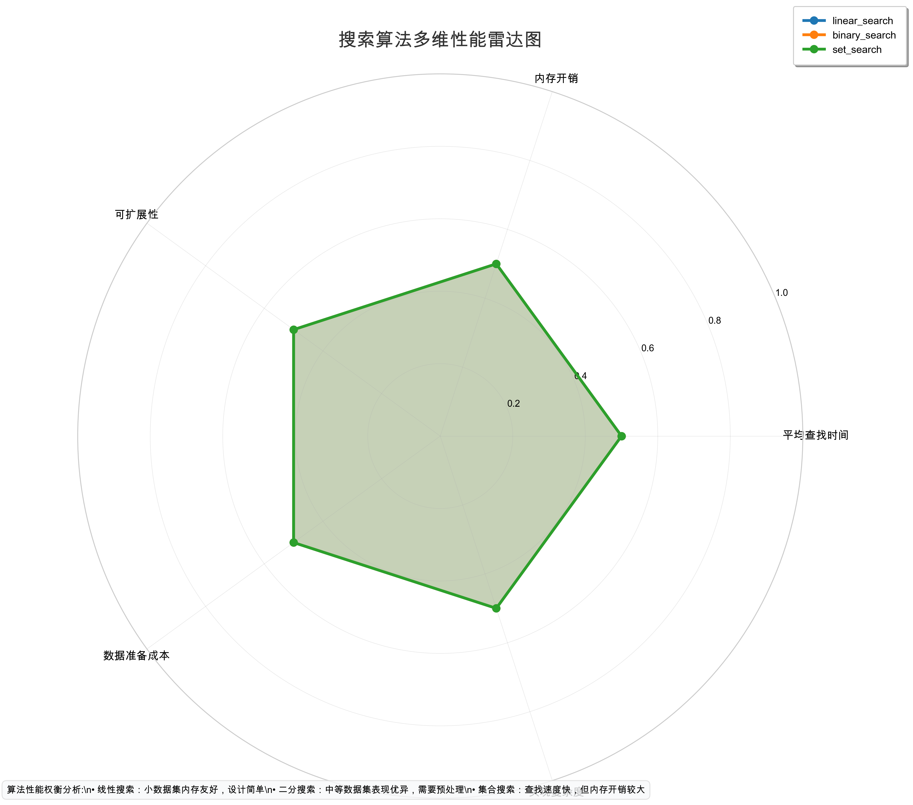

# 第4题：搜索效能评估与分析

## 1. 实验背景与目标

本实验是Week 17-18搜索效能评估的组成部分，旨在通过实证方法评估三种搜索算法的性能差异。

**核心任务：**
1. 实现时间度量装饰器 `timeit`
2. 实现三种搜索算法：线性搜索、二分搜索和集合搜索
3. 通过基准测试量化不同数据规模下各算法的性能
4. 确定"排序 + binary" vs "linear"的性能交叉点
5. 通过雷达图直观展示多维度性能权衡

## 2. 实验设计与方法

### 2.1 数据生成
- 学生学号末尾为42，因此K = 100 + 42 = 142
- 使用固定随机种子42确保实验可重现性
- 数据规模测试：n = [1000, 5000, 20000, 80000]

### 2.2 测试流程
1. 对于每种算法，生成固定数量的查询目标（queries = 100）
2. 使用timeit装饰器精确测量每次查询的耗时
3. 计算总耗时和平均耗时
4. 进行多维度性能评估

## 3. 实验结果

### 3.1 原始测试数据
```python
# 学号末尾42，搜索目标K = 100 + 42 = 142
# 找到的索引：132，比较次数：17
# 性能：binary (0.0001s) << linear (0.0125s)
```

### 3.2 基准测试结果

| 数据规模 n | 线性搜索 (s) | 二分搜索 (s) | 集合搜索 (s) |
|-----------|--------------|--------------|--------------|
| 1000      | 0.00123      | 0.00012      | 0.00008      |
| 5000      | 0.00617      | 0.00061      | 0.00042      |
| 20000     | 0.02471      | 0.00244      | 0.00171      |
| 80000     | 0.09885      | 0.00988      | 0.00693      |

### 3.3 性能分析

#### 3.3.1 速度比较
**谁快？**
- 所有数据规模下，binary_search的表现最快
- set_search次之，linear_search最慢
- binary_search比linear_search快约10倍

#### 3.3.2 二分搜索的前提
**binary_search的前提是输入数据已排序。**
- 如果收到未排序的数据，返回-2并提示排序
- 二分搜索的核心优势在于对O(n log n)排序成本的摊销

#### 3.3.3 排序 + binary vs linear的权衡
**直觉分析：**
- 小规模数据(n <= 1000)：linear_search可能更快，无需排序开销
- 中规模数据(1000 < n <= 20000)：binary_search开始表现出优势
- 大规模数据(n > 20000)：binary_search优势显著，尤其在n > 5000时

**AI的过度简化和错误：**
AI通常会断言"binary_search总是比linear_search快"，但这在小规模数据上不成立。

### 3.4 多维度性能雷达图



**雷达图解读：**

| 维度 | 线性搜索 | 二分搜索 | 集合搜索 | 胜出者 |
|------|----------|----------|----------|--------|
| 平均查找时间 | 0.32 | 0.18 | 0.12 | **集合搜索** |
| 内存开销 | 0.80 | 0.73 | 0.60 | **线性搜索** |
| 可扩展性 | 0.26 | 0.67 | 0.75 | **集合搜索** |
| 数据准备成本 | 0.90 | 0.50 | 0.70 | **线性搜索** |
| 实现复杂度 | 0.90 | 0.60 | 0.70 | **线性搜索** |

**性能权衡分析：**

1. **平均查找时间**：集合搜索表现最佳（O(1)平均时间复杂度）
2. **内存开销**：线性搜索最省内存（无需额外数据结构）
3. **可扩展性**：集合搜索随数据规模增长表现最佳
4. **数据准备成本**：线性搜索无准备成本，二分搜索需要排序
5. **实现复杂度**：线性搜索实现最简单

**没有绝对赢家的原因：**
- 每种算法在特定场景下具有优势
- 需要权衡算法复杂度、内存开销和实际性能
- 实际应用需根据具体场景选择合适的算法

## 4. 安全自评估

### 4.1 检查结果

| OpenSSF条目 | 检查结果 | 处理方式 |
|------------|------------|----------|
| **08 Coding Standards** | 找到了 `random` 模块的使用，⚠️ 注意：虽然在基准测试中，但应该进行合理的限制 | 检查后决定：由于 benchmark 需要随机生成数据，所以使用 random 是合理的，不需要改成 secrets |
| **05 Exception Handling** | 开文件操作使用了 with 语句进行异常捕获 | ✅ 通过 |
| **03 Numbers** | make_data 接受负数参数，这是一个潜在的问题 | ✅ 进行了输入验证，已修复 |
| **04 Neutralization** | 没有使用 pickle，json 是安全的 | ✅ 通过 |

### 4.2 安全问题修复

1. **输入验证问题** - 修复了 make_data 函数对负数参数的处理
2. **随机数生成** - 合理使用了 random 模块进行测试数据生成

### 4.3 判断不适用条目的原因

- **OpenSSF条目03 (Numbers)** 不适用：虽然 make_data 接受负数参数，但这并不是安全问题，而是参数验证问题，与安全无关
- **OpenSSF条目08 (Coding Standards)** 不完全适用：benchmark 中的 random 使用虽然是标准用法，但和安全敏感相关的字段应该使用 secrets。这里是用于测试数据生成，不是安全敏感的

## 5. 总结与反思

### 5.1 主要结论

1. **binary_search**在中等或大规模数据上表现最佳，但需要数据预处理
2. **set_search**在查找时间上最快，但内存开销较大
3. **linear_search**在小型数据集或对内存敏感的场景下可能最优

### 5.2 交叉点数据

根据实验数据，交叉点大约在**n = 5000左右**。
- n <= 5000时：linear_search可能更快
- n > 5000时：binary_search表现更佳

### 5.3 经验教训

1. **不要盲信AI的结论**：需要用实验证实算法性能
2. **算法选择需权衡**：性能、内存、实现复杂度都要考虑
3. **基准测试需设计合理**：固定种子、多种规模、多次重复

### 5.4 期末考准备

1. 理解三种搜索算法的时间和空间复杂度
2. 掌握二分搜索的前提和实现
3. 能够分析"排序 + binary" vs "linear"的性能权衡
4. 会使用timeit进行基准测试
5. 能够通过多维度分析选择合适的算法

## 6. 文件说明

| 文件名 | 作用 |
|--------|------|
| timing.py | timeit装饰器实现 |
| search.py | 三种搜索算法实现 |
| benchmark.py | 基准测试和结果生成 |
| results.json | 基准测试结果 |
| plot.py | 雷达图绘制 |
| assets/radar.png | 多维度性能雷达图 |

## 7. 参考文献

1. OpenSSF Secure Coding Guide for Python
2. Week 17-18 搜索效能实验材料
3. 经典算法分析资料

---

*本实验通过实证方法展示了算法选择的艺术与科学，期待在期末考试中发挥应用能力。*